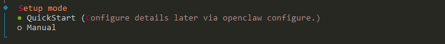
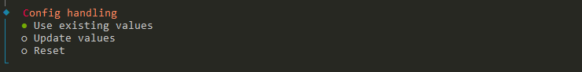
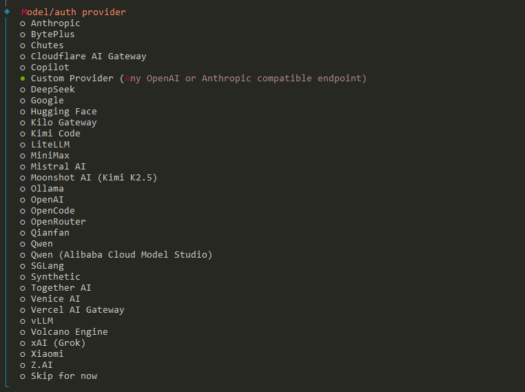
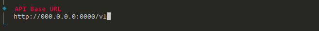
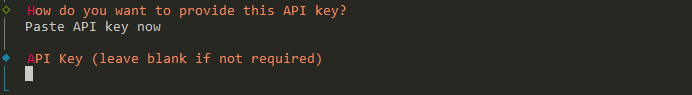
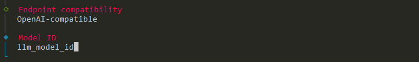
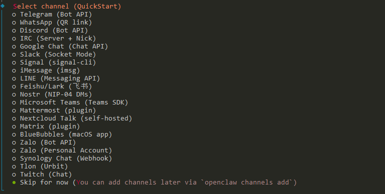
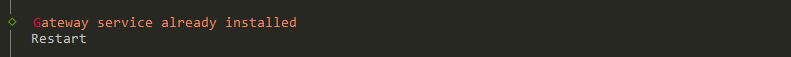
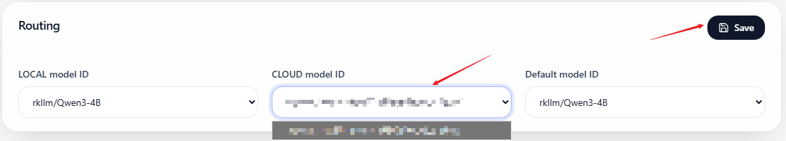
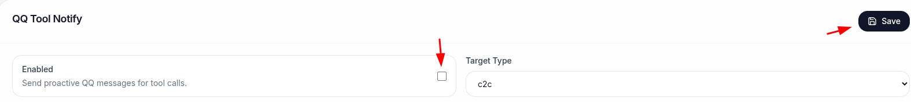

# ClawChips Quick Start

**目录**

[TOC]

---

## 1 环境准备

### 1.1 硬件要求

- RK_EVB10_RK3588_V10开发板 × 1
- RK1820/1828协处理器 × 1
- USB-C数据线 × 1
- RK3588电源适配器 × 1
- 计算机 × 1

### 1.2 连接开发板

1. 将RK1820/1828模组插入到RK_EVB10_RK3588_V10开发板上
1. RK_EVB10_RK3588_V10开发板需连接互联网
2. 将开发板上的USB端口通过数据线与计算机相连
3. 打开电源开关，等待开发板系统启动完成
4. 验证设备连接

```bash
# 计算机（主机）的终端执行

# 查询adb连接的设备
adb devices

# 连接成功时输出信息如下，其中 13af7b28115662cd 为 RK3588 的设备 ID
# List of devices attached
# 13af7b28115662cd device
```

### 1.3 验证RK1820/1828连接

```bash
# 连接RK3588
adb shell

# 进入rknn3_transfer_proxy安装路径（Linux系统）
cd /usr/bin

# 查询设备
./rknn3_transfer_proxy devices

# 参考输出如下
# List of ntb devices attached
# 0000:01:00.0        b98e6c51    PCIE
```

> **注意**：若找不到rknn3_transfer_proxy，请先完成第2章部署ClawChips

---

## 2 部署 ClawChips

首先检查开发板是否已经烧写ClawChips系统镜像：

```bash
# 连接RK3588
adb shell

# 切换到普通用户
su linaro

# 检查命令
openclaw plugins list |grep clawchips

# 预期输出如下字段，则说明已烧写 ClawChips 系统镜像，否则未烧写
# clawchips    │          │ openclaw │ loaded   │ global:clawchips/dist/index.js
```

若已烧写ClawChips系统镜像，则可以直接跳转至 [2.3 配置云端模型](#configCloud)

若未烧写ClawChips系统镜像，目前提供了2种部署方式：

* 系统镜像快捷部署
* 手动部署

用户可按需选择部署方式，部署所需的资源文件目前需要向此官方邮箱发邮件申请：[rkmarketing@rock-chips.com](mailto:rkmarketing@rock-chips.com)

### 2.1 系统镜像快捷部署

烧写系统镜像的步骤如下：

* 从官方路径下载镜像文件 update.img
* RK3588开发板上的 ADB  端口通过数据线与计算机相连
* 完成驱动安装：
  - Windows：安装 DriverAssitant_v5.14 驱动；
  - Linux ：无需安装，直接使用 upgrade_tool 工具即可；
* 安装烧写工具：
  - Windows：使用 RKDevTool_v3.41_for_window 工具
  - Linux：使用 upgrade_tool_v2.55_for_linux 工具
* RKDevTool_v3.41_for_window：解压即用，解压后可阅读 《开发工具使用文档_v1.0.pdf》学习如何使用
* upgrade_tool_v2.55_for_linux ：解压即用，解压后可阅读 《命令行开发工具使用文档.pdf》学习如何使用

烧写完成后即可跳转至 [2.3 配置云端模型](#configCloud)

### 2.2 手动部署

#### 2.2.1 操作系统要求

* **计算机（主机端）**：已安装 adb 调试工具

* **RK3588 开发板（板端）**：Debian/Ubuntu 操作系统，需要安装以下依赖：

```bash
# 连接RK3588
adb shell 

# 更新软件源
sudo apt update

# 安装基础工具
sudo apt install -y ffmpeg adb curl cron

# 安装python3相关工具
sudo apt install -y python3 python3-pip python3.11-venv python3-numpy python3-pil

# 验证安装
python3 --version
pip3 --version
ffmpeg -version
adb --version
```

> **注意**：安装过程中需要保持开发板连接互联网

#### 2.2.2 安装 RKNN3

RKNN3 提供了大模型板端运行时的软件环境，支持在 RK1820/1828 协处理器上部署大语言模型。主要包含下列组成部分：

| 组件 | 说明 |
|------|------|
| rk1820_firmware | RK1820/1828协处理器固件 |
| rknn3_api | RKNN模型加载、推理、LLM模型推理及会话管理等核心功能库 |
| rkllm3-server | 提供OpenAI兼容API服务，支持文本和图片输入 |
| rknn3_transfer_proxy | 提供Host端与RK1820/1828协处理器间的通信接口，支持PCIe和USB连接 |

##### 2.2.2.1 获取 RKNN3

从官方路径下载RKNN3安装包，RKNN3 的目录结构：

```bash
rknn3-20260326_190956
├─ 20260326_190956
│  ├─ rk1820_firmware
│  └─ rknn3-runtime
│     ├─ rknn3-api
│     ├─ rkllm3-server
│     └─ rknn3_transfer_proxy
└─ install_rknn3.sh
```

##### 2.2.2.2 执行安装

将 RKNN3 路径保存到变量后执行以下命令：

```bash
# 在主机端执行

RKNN3_PATH=/path/to/rknn3  # 替换为实际路径

# 推送RK1820/1828固件（sodimm模块）
adb push ${RKNN3_PATH}/rk1820_firmware/EXT_SODIMM/update.img /usr/lib/firmware/rknn3_rk1820.img

# 推送 rkllm3-server
adb push ${RKNN3_PATH}/rknn3-runtime/rkllm3-server/bin/linux-aarch64/rkllm3-server /usr/bin/rkllm3-server

# 增加可执行权限
adb shell chmod +x /usr/bin/rkllm3-server

# 推送传输代理
adb push ${RKNN3_PATH}/rknn3-runtime/rknn3_transfer_proxy/linux-aarch64/rknn3_transfer_proxy /usr/bin/rknn3_transfer_proxy

# 增加可执行权限
adb shell chmod +x /usr/bin/rknn3_transfer_proxy

# 推送 RKNN3 API 库
adb push ${RKNN3_PATH}/rknn3-runtime/rknn3-api/Linux/aarch64/* /usr/lib/

# 同步文件系统
adb shell sync

# 重启设备（使固件及相关服务生效）
adb shell reboot
```

##### 2.2.2.3 验证安装

重启后，通过以下命令验证 RKNN3 是否安装成功：

```bash
# 检查 rkllm3-server 是否存在
adb shell ls -la /usr/bin/rkllm3-server

# 检查 rknn3_transfer_proxy 是否存在
adb shell ls -la /usr/bin/rknn3_transfer_proxy

# 检查 RKNN3 API 库是否安装
adb shell ls -la /usr/lib/librknn3_api.so

# 进入开发板终端，检查 rknn3_transfer_proxy 服务状态
adb shell
cd /usr/bin
./rknn3_transfer_proxy devices

# 预期输出：
# List of ntb devices attached
# 0000:01:00.0        xxxxxx    PCIE
```

#### 2.2.3 部署大模型 API 服务

rkllm3-server 提供 OpenAI 兼容 API 服务，支持文本和图片输入，暂不支持语音和视频输入

##### 2.2.3.1 部署模型文件

从官方路径获取模型 qwen3-4b-thinking，目录结构如下：

```bash
qwen3-4b-thinking
├─ Qwen3-4B.rknn           #RKNN 模型文件
├─ Qwen3-4B.tokenizer.gguf #词表文件
├─ Qwen3-4B.embed.bin      #embedding 文件
├─ Qwen3-4B.weight         #weight 文件
└─ run.sh                  #启动rkllm3-server的脚本
```

将模型文件推送至板端：

```bash
# 推送文件
adb push qwen3-4b-thinking /userdata/
# 同步文件系统
adb shell sync
```

##### 2.2.3.2 启动 rkllm3-server

```bash
# 连接RK3588
adb shell 

# 切换到模型文件目录
cd /userdata/qwen3-4b-thinking

# 增加可执行权限
chmod +x ./run.sh

# 启动 rkllm3-server
./run.sh
```

##### 2.2.3.3 验证 rkllm3-server

启动后，通过以下命令验证服务是否正常运行：

```bash
# 在主机端执行，测试 API 是否可访问
curl http://127.0.0.1:8080/v1/models

# 预期输出示例：
# {
#   "object": "list",
#   "data": [
#     {
#       "id": "Qwen3-4B",
#       "object": "model",
#       "created": 1234567890,
#       "owned_by": "rockchip"
#     }
#   ]
# }

# 或者在开发板终端检查进程
adb shell "ps aux | grep rkllm3-server"
```

#### 2.2.4 安装 OpenClaw

> ⚠️ **注意**：以下步骤在 **RK3588 开发板** 上执行。如果通过 adb 连接到开发板，建议先执行 `adb shell su linaro` 切换为普通用户，后续操作都在普通用户下进行

##### 2.2.4.1 安装 Node.js

```bash
# 连接RK3588
adb shell 

# 切换为普通用户
su linaro

# 安装 nvm
sudo curl -o- https://raw.githubusercontent.com/nvm-sh/nvm/v0.40.4/install.sh | bash

# 加载 nvm 环境变量（每次打开新终端都需要执行，或者添加到 ~/.bashrc）
source "$HOME/.nvm/nvm.sh"

# 安装 Node.js 25
nvm install 25

# 验证安装
node -v
npm -v
```

##### 2.2.4.2 安装 OpenClaw

推荐安装 2026.3.24 的版本：

```bash
# 连接RK3588
adb shell 

# 切换为普通用户
su linaro

# 加载 nvm 环境变量
source "$HOME/.nvm/nvm.sh"

# 安装 OpenClaw
npm install -g openclaw@2026.3.24
```

#### 2.2.5 安装 ClawChips 插件

##### 2.2.5.1 安装插件

ClawChips 内置一个本地运行的智能路由网关，位于 OpenClaw 与多个模型后端之间

* 智能识别任务复杂度，支持任务请求在本地 / 云端路由本地智能路由
* 支持记忆路由配合使用，持续优化路由决策
* 支持Dashboard配置界面

详细的安装方法和使用说明请参考：https://github.com/airockchip/clawchips/blob/main/README_ZH.md

##### 2.2.5.2 安装记忆路由依赖

如果开启记忆路由功能，还需要按照如下在RK3588开发板本地部署一个embedding模型服务（如果使用系统镜像快捷部署则该服务已经预装，只需确认一下服务是否正常运行）

```bash
# 连接RK3588
adb shell

# 部署embedding模型服务
cd /userdata/
curl -fsSL https://raw.githubusercontent.com/airockchip/clawchips/main/scripts/install_memory_router_deps.sh | bash -s --

# 确认服务是否正常运行
journalctl -u embedding-rknn-server.service

# 有看到如下日志则表示服务正常运行
# I:        Application startup complete.
# I:        Uvicorn running on http://0.0.0.0:18080 (Press CTRL+C to quit)
```

### 2.3 配置云端模型 <span id="configCloud"></span>

#### 2.3.1 配置 OpenClaw

这一步主要为了配置API服务。因为本地部署的模型服务在安装ClawChips插件时会自动配置，此处只需要完成云端模型厂商API服务配置

```bash
# 连接RK3588
adb shell

# 切换为普通用户
su linaro

# 初始化 OpenClaw
openclaw onboard --install-daemon
```

详细步骤：

* 选择yes后enter；选择QuickStart



* 选择Use existing values



* 配置模型

  * 选择云端模型厂商的名称。此处以⾃部署的模型为例，选择Custom Provider

  

  * 配置API base URL，需要配置为真实的URL

  

  * 配置API key

  

  * 选择OpenAI-compatible；输入Model ID，用户需要配置为真实的Model ID

  

* 后续的配置流程先跳过，选择Skip for now，例如：



* 配置完成后重启OpenClaw



#### 2.3.2 配置 ClawChips

* OpenClaw启动后在主机端访问Dashboard Web页面，访问的URL：`http://<ip>:18789/plugins/clawchips/dashboard`
* 在Web页面开启的下拉选项中选择CLOUD model ID配置，预期为上一步配置的OpenClaw云端模型，然后点击保存



#### 2.3.3 验证 ClawChips 配置

查看 `~/.openclaw/clawchips.yaml` 文件，参考配置：

```yaml
router:
  strategy: rules
  rules:
    - LOCAL: rkllm/Qwen3-4B
    - CLOUD: custom-000-00-00-00-0000/llm_model_id
    - default: rkllm/Qwen3-4B

memory:
  enabled: true
  top_k: 10
  score_threshold: 0.75
  max_query_chars: 500
  max_prompt_chars: 200
  per_user: false

embedding:
  type: openai-compatible
  provider: rknn-embedding-server
  model: rknn-embedding
  endpoint: http://localhost:18080
  dimensions: 2560

storage:
  max_prompt_chars: 200
```

配置参数说明：

* LOCAL: rkllm/Qwen3-4B：配置为openclaw.json中声明的本地部署模型
* CLOUD: custom-000-00-00-00-0000/llm_model_id：配置为openclaw.json中声明的云端模型
* default: rkllm/Qwen3-4B：默认使用本地模型

---

## 3 安装 rk-skills

### 3.1 安装 skills

[ClawChips开源工程](https://github.com/airockchip/clawchips )内的skills目录内置了针对端侧芯片平台精选的skill：

```
skills
├── README.md
├── rk-adb
├── rk-asr
├── rk-binary-image-decoder
├── rk-hwc-troubleshooting
├── rk-iva
├── rk-model-benchmark
└── rk-tts
```

安装方法：

```bash
# 推送skills到openclaw工作目录
adb push path/to/clawchips/skills /home/linaro/.openclaw/workspace

# 连接RK3588
adb shell

# 修改skills权限为普通用户
chown -R linaro:linaro /home/linaro/.openclaw/workspace/skills

# 切换为普通用户
su linaro

# 重启openclaw
openclaw gateway restart
```

在后续与OpenClaw的对话过程中，OpenClaw会根据对话内容自动使用合适的skill

### 3.2 安装 skills 依赖文件

#### 3.2.1 系统镜像快捷部署

若用户使用的是**系统镜像快捷部署**方式，需要执行如下步骤：

* 修改文件权限

```bash
# 连接RK3588
adb shell

# 修改skills权限为普通用户
chown -R linaro:linaro /userdata/skills

# 切换为普通用户
su linaro

# 重启openclaw
openclaw gateway restart
```

* 检查是否已经授权

```bash
# 连接RK3588
adb shell

# 若此2个文件存在，则已经授权
ls /userdata/key_asr.lic
ls /userdata/key_tts.lic
```

* 进行算法授权，若已经授权则跳过此步骤（只有rk-asr和rk-tts这两个skill才需要执行授权，授权信息可联系我司业务获取）：

```bash
# 连接RK3588
adb shell

# 执行授权
cd /userdata/skills/ && ./rkauth.sh <username> <password>
```

#### 3.2.2 手动部署

若用户使用的是**手动部署**方式，需要执行如下步骤：

* 从官方路径获取依赖文件安装包skills_res.tgz，解压后可看到目录结构：

```
skills_res
└── skills
    ├── rk-asr
    ├── rk-iva
    ├── rk-tts
    ├── rkauth.sh
    └── rkauth_tool_bin
```

* 安装方法：

```bash
# 推送skill_res/skills到/userdata
adb push path/to/skill_res/skills /userdata/skills

# 连接RK3588
adb shell

# 修改skills权限为普通用户
chown -R linaro:linaro /userdata/skills

# 切换为普通用户
su linaro

# 重启openclaw
openclaw gateway restart
```

* 完成算法授权（只有rk-asr和rk-tts这两个skill才需要执行授权，授权信息可联系我司业务获取）：

```bash
# 连接RK3588
adb shell

# 执行授权
cd /userdata/skills/ && ./rkauth.sh <username> <password>
```

------

## 4 安装 QQBot 插件

### 4.1 安装 QQBot

* 访问官方网站：https://q.qq.com/qqbot/openclaw/index.html

* 点击创建机器⼈，然后获取到AppID和AppSecret

* 根据官⽅教程安装插件和配置

```bash
# 连接RK3588
adb shell 

# 切换为普通用户
su linaro

# 安装OpenClaw开源社区QQBot插件
openclaw plugins install @tencent-connect/openclaw-qqbot@latest

# 配置绑定当前QQ机器人
openclaw channels add --channel qqbot --token "your-appid:your-appsecret" 

# 重启本地OpenClaw服务
openclaw gateway restart
```

重启完成就可以⽤QQ上创建的机器⼈直接给OpenClaw发送消息

### 4.2 启用QQ消息优化

同时安装ClawChips和QQBot前提下，可以启用ClawChips对QQBot的优化：

* OpenClaw启动后即可访问Dashboard Web页面，访问的URL：`http://<ip>:18789/plugins/clawchips/dashboard`
* 在Web页面开启优化，并保存配置



此优化可以将工具调用的提示发送到QQ消息中，优化响应体验

------

## 5 验证部署

### 5.1 检查服务状态

确保 rkllm3-server 正在运行：

```bash
# 连接RK3588
adb shell 

# 切换为普通用户
su linaro

# 检查进程
ps aux | grep rkllm3-server

# 测试 API
curl http://127.0.0.1:8080/v1/models
```

### 5.2 测试 OpenClaw

用户可以通过以下2种方式进行测试：

* 通过tui接入对话

```bash
# 连接RK3588
adb shell 

# 切换为普通用户
su linaro

# tui接入对话
openclaw tui

# 开始新对话
/new
```

* 访问ClawChips的Dashboard web页面，使用说明请参考：https://github.com/airockchip/clawchips/blob/main/README_ZH.md

------

## 附录

### 附录 A：目录结构

```
~/.openclaw/
├── openclaw.json          # 主配置文件
├── clawchips.yaml         # ClawChips 配置文件
├── workspace              # 工作目录
└── agents/
    └── main/
        └── sessions/      # 对话会话目录
```

### 附录 B：参考资源

- OpenClaw 官方文档：https://docs.openclaw.ai/install
- ClawChips GitHub：https://github.com/airockchip/clawchips
- RKNN3 Toolkit GitHub：https://github.com/airockchip/rknn3-toolkit

### 附录 C：常见问题

#### 1 adb 连接问题

**问题：执行 `adb devices` 显示找不到设备**

解决方法：
```bash
# 检查 adb 服务是否启动
adb start-server

# 如果设备仍无法识别，检查 USB 调试是否开启
# 在开发板上执行：设置 -> 开发者选项 -> USB 调试（开启）
```

**问题：如何通过网络连接 adb（无需 USB 线）**

```bash
# 1. 先通过 USB 连接开发板
# 2. 在开发板上设置 TCPIP 模式
adb shell
setprop service.adb.tcp.port 5555
stop adbd
start adbd

# 3. 在主机端执行
adb connect <开发板IP>:5555

# 4. 断开 USB 线，后续可通过 WiFi 连接
```

#### 2 rknn3_transfer_proxy 问题

**问题：执行 `./rknn3_transfer_proxy devices` 找不到设备**

可能原因：
1. RK1820 固件未正确烧录 - 请重新执行 2.3 节安装命令
2. PCIe/USB 连接异常 - 检查硬件连接
3. 设备未重启 - 执行 `adb shell reboot` 重启开发板

#### 3 OpenClaw 安装问题

**问题：npm install 失败，提示网络错误**

解决方法：
```bash
# 配置 npm 代理（如果需要）
npm config set proxy http://<代理地址>:<端口>
npm config set https-proxy http://<代理地址>:<端口>

# 或者使用国内镜像
npm config set registry https://registry.npmmirror.com
```

**问题：安装 OpenClaw 报错 `ENOTEMPTY`**

解决方法：
```bash
# 删除旧的 OpenClaw 目录后重试
rm -rf ~/.npm-global/lib/node_modules/openclaw
npm install -g openclaw@2026.3.24
```

#### 4 rkllm3-server 问题

**问题：rkllm3-server 启动失败，提示找不到模型文件**

确保模型文件路径正确：
```bash
# 检查模型文件是否存在
adb shell
ls -la /path/to/your/model/*.rknn
ls -la /path/to/your/model/*.tokenizer.gguf
ls -la /path/to/your/model/*.embed.bin
```

**问题：API 请求返回连接失败**

```bash
# 检查 rkllm3-server 是否正在运行
adb shell
ps aux | grep rkllm3-server

# 检查端口是否正常监听
netstat -tlnp | grep 8080
```

