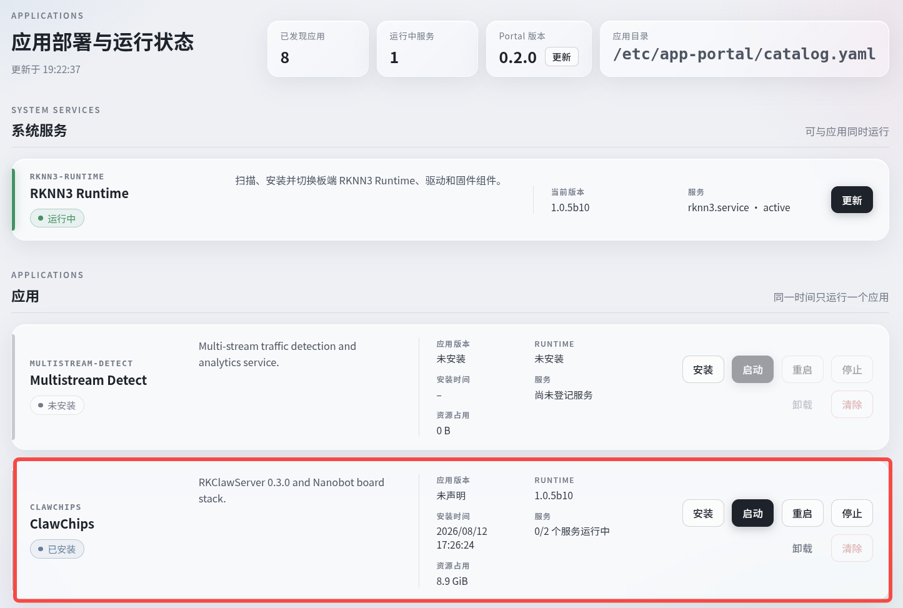
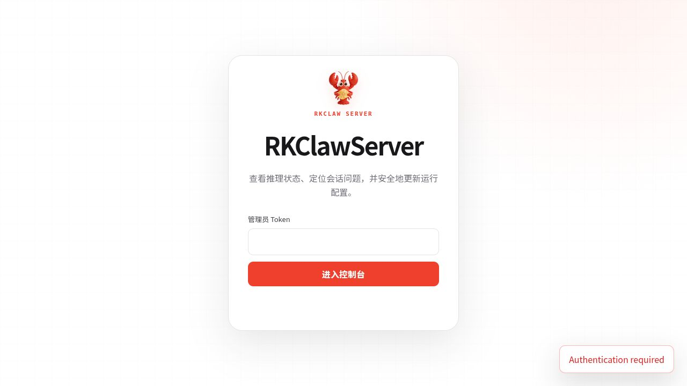
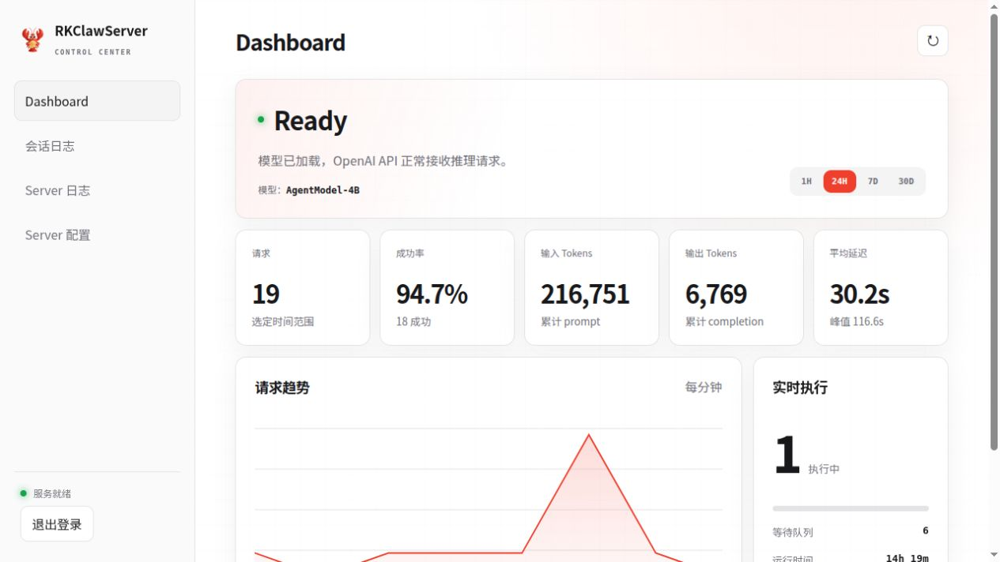
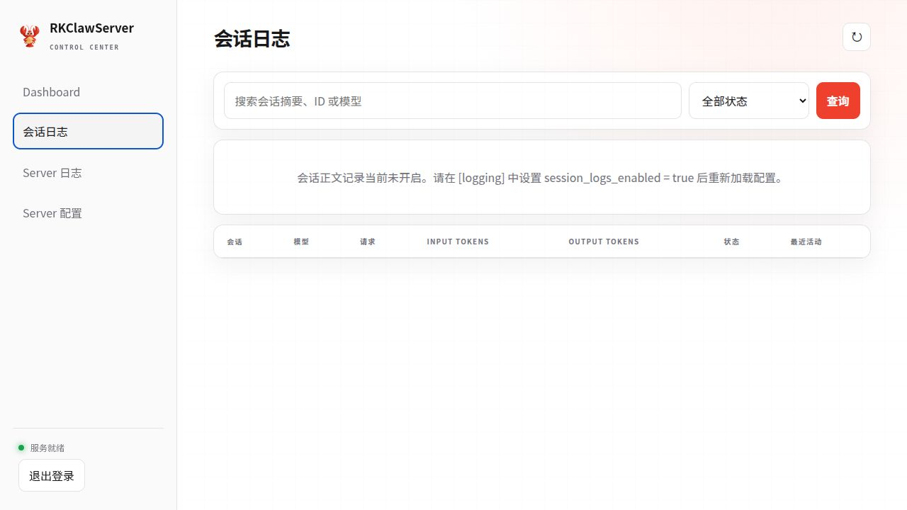
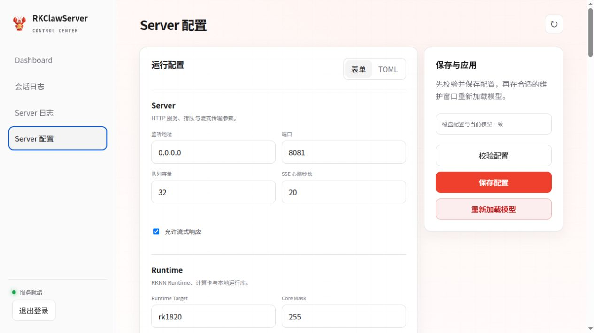
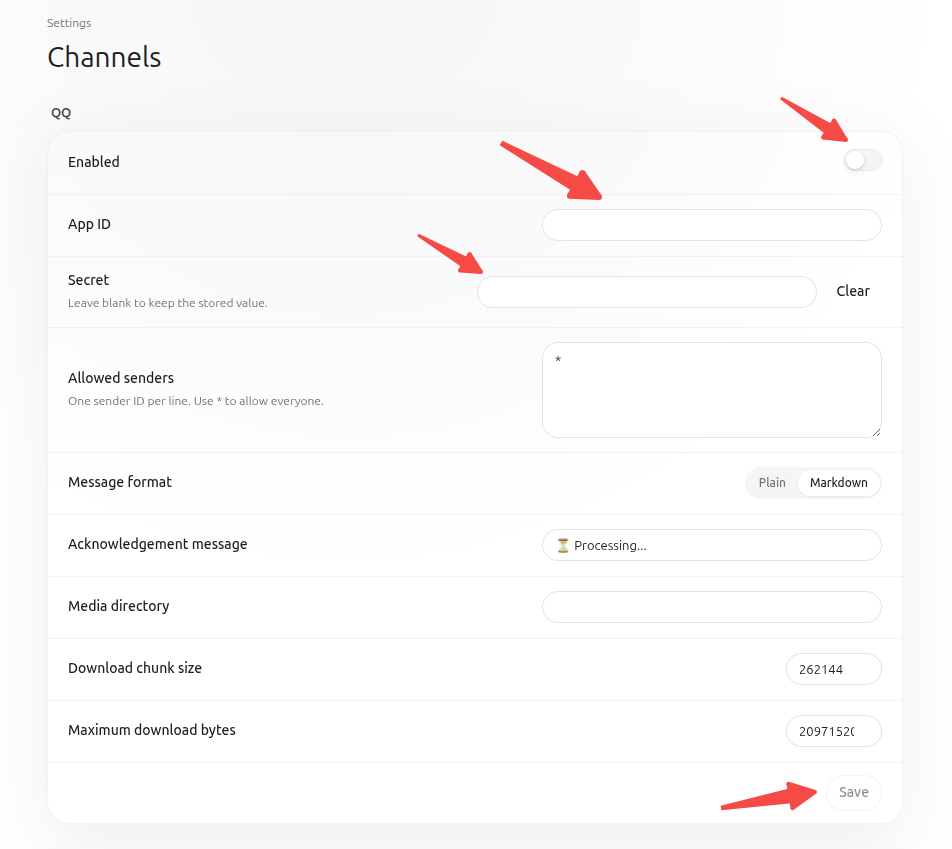
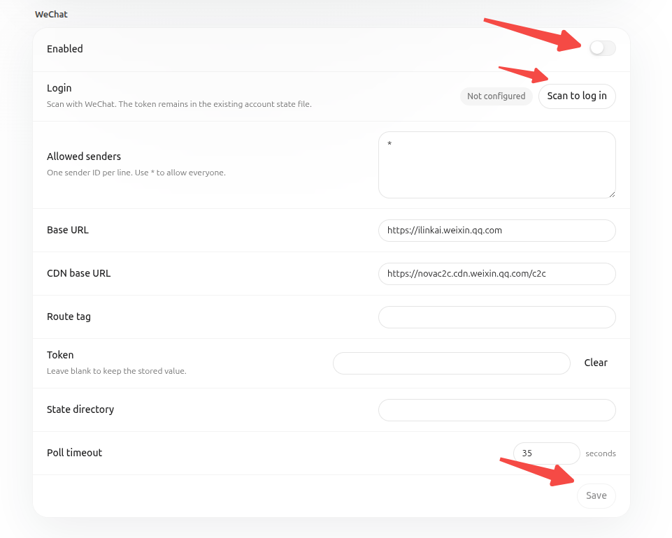
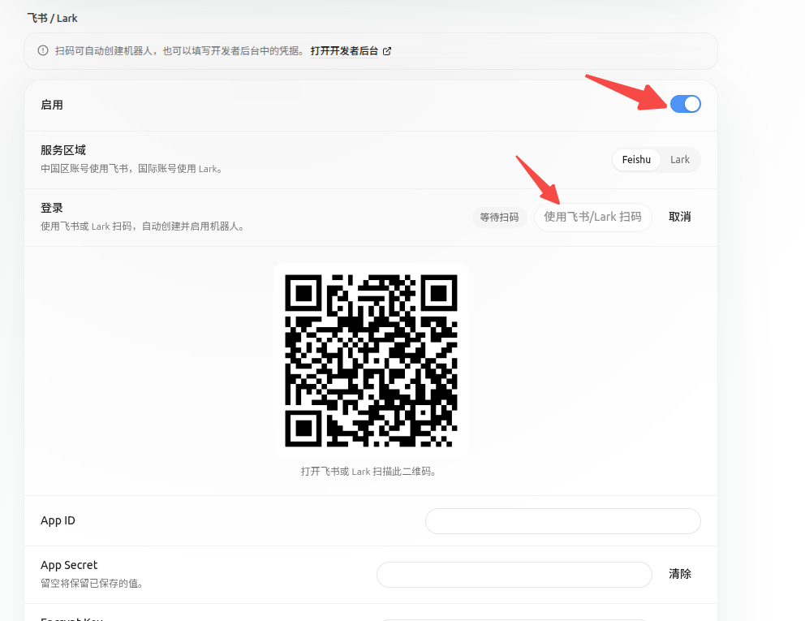
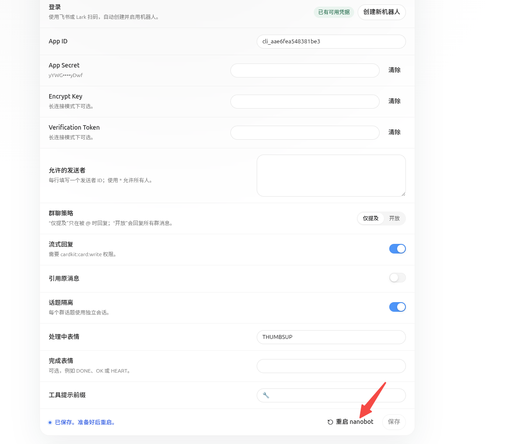
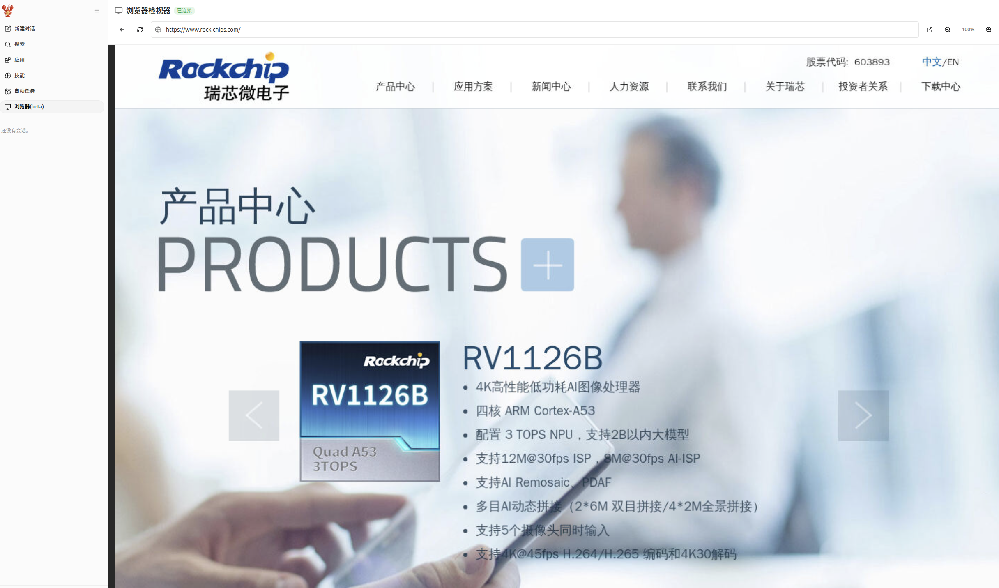

# Rockchip RK1820 RK1828 ClawChips 使用指南

文件标识：RK-JC-YF-437

发布版本：V0.7.0

日期：2026-08-15

文件密级：□绝密   □秘密   □内部资料   ■公开

**免责声明**

本文档按“现状”提供，瑞芯微电子股份有限公司（“本公司”，下同）不对本文档的任何陈述、信息和内容的准确性、可靠性、完整性、适销性、特定目的性和非侵权性提供任何明示或暗示的声明或保证。本文档仅作为使用指导的参考。

由于产品版本升级或其他原因，本文档将可能在未经任何通知的情况下，不定期进行更新或修改。

**商标声明**

“Rockchip”、“瑞芯微”、“瑞芯”均为本公司的注册商标，归本公司所有。

本文档可能提及的其他所有注册商标或商标，由其各自拥有者所有。

**版权所有 © 2026 瑞芯微电子股份有限公司**

超越合理使用范畴，非经本公司书面许可，任何单位和个人不得擅自摘抄、复制本文档内容的部分或全部，并不得以任何形式传播。

瑞芯微电子股份有限公司

Rockchip Electronics Co., Ltd.

地址：     福建省福州市铜盘路软件园 A 区 18 号

网址：     [www.rock-chips.com](http://www.rock-chips.com)

客户服务电话： +86-4007-700-590

客户服务传真： +86-591-83951833

客户服务邮箱： [fae@rock-chips.com](mailto:fae@rock-chips.com)

---

**前言**

**概述**

本文介绍适用于 RK1820/RK1828 平台的 ClawChips V0.7.0 固件及配套软件的部署、配置和使用方法。

**产品版本**

| **芯片名称**  | **版本** |
| ------------- | -------- |
| RK1820/RK1828 | 0.7.0    |

**读者对象**

本文档（本指南）主要适用于以下工程师：

技术支持工程师

软件开发工程师

**修订记录**

| **版本号** | **作者** | **修改日期** | **修改说明** |
| ---------- | -------- | ------------ | ------------ |
| V0.7.0     | YHC      | 2026-08-15   | 初始版本     |

---

**目录**

[TOC]

---

## 固件版本

### V0.7.0（2026-08-15）

更新内容：

- 端侧模型网关RKClawServer

    - 基于 RKNN3 在本地推理 LLM 模型，提供 OpenAI 兼容 Chat Completions API，支持同步和流式输出
    - 支持模型ToolCall错误矫正，执行更稳定
    - 支持KV-Cache自动保存加载，优化首会话延迟体验
    - 支持WebUI可视化

- Harness

    - 支持完全通过WebUI界面操作，无需命令行
    - 优化文档读取和 `web fetch` 等功能
    - 支持结构化引擎，本地调用音频、视觉、OCR算法
    - 安装并启用可选浏览器组件后，支持 WebUI 同步设备端浏览器页面，方便用户与 Agent 进行浏览器交互

下载地址：链接: https://console.box.lenovo.com/l/7oO2WM  提取码: rknn

## 安装说明

ClawChips 支持烧写固件、App Portal 一键部署和手动部署 3 种安装方式。

### 烧写固件

烧写系统镜像的步骤如下：

1. 从网盘的 `image` 目录下载最新的镜像文件压缩包并解压，从 `tools` 目录下载对应操作系统驱动和烧写工具。
2. 使用数据线连接 RK3588 开发板的 ADB 端口与计算机。
3. 根据计算机操作系统准备驱动：

    - Windows：安装 DriverAssitant V5.14 驱动
    - Linux：无需安装驱动，直接使用 `upgrade_tool` 工具
    - macOS：无需安装驱动，直接使用 `upgrade_tool` 工具

4. 从网盘的 `tools` 目录下载对应的烧写工具：

    - Windows：RKDevTool V3.41 for Windows
    - Linux：upgrade_tool V2.55 for Linux
    - macOS：upgrade_tool V2.55 for macOS

5. 解压烧写工具并完成固件烧写：

    - 使用 RKDevTool V3.41 for Windows 时，参考《开发工具使用文档 V1.0.pdf》操作。
    - 使用 upgrade_tool V2.55 for Linux 或 macOS 时，参考《命令行开发工具使用文档.pdf》操作。

      - 参考命令

      ```
      # 查看进入烧写模式设备
      upgrade_tool LD
      # 烧写update固件
      upgrade_tool UF xxx.img
      ```

### App Portal

App Portal 是运行在 RK1820/RK1828 板端的应用交付与生命周期控制面，能够一键安装和启动 RK 提供的 Demo 程序包。

通过 App Portal 部署 ClawChips 的方法如下：

- 打开 App Portal 的后台界面（地址 `http://<设备 IP>:18090`）

- 找到 ClawChips，单击 **安装**，等待下载完成

- 下载完成后，单击 **启动**

<p align="center">
  
</p>
<p align="center">图 1 App Portal 安装并启动 ClawChips</p>

### 手动部署

用户也可以选择手动部署 ClawChips 服务，需要分别部署RKClawServer和Agent程序两部分组件。

#### RKClawServer 部署

本节以 `clawchips_v0.7.0_20260815` 发布包中的 RKClawServer 0.3.2 组件为例。组件及其部署文档位于以下目录：

```text
packages/rk-claw-server-0.3.2-linux-aarch64/
packages/rk-claw-server-0.3.2-linux-aarch64/README.md
packages/rk-claw-server-0.3.2-linux-aarch64/DEPLOYMENT-PROFILE.md
```

本节中的 `<发布包根目录>` 表示 `clawchips_v0.7.0_20260815` 目录。

**检查部署环境**

目标设备应满足以下要求：

| **项目** | **要求** |
| -------- | -------- |
| 设备 | RK3588+RK1828，aarch64 |
| 操作系统 | Debian GNU/Linux 12 或兼容环境 |
| Python | CPython 3.11，路径为 `/usr/bin/python3` |
| GLIBC | 不低于 2.27，建议使用 2.36 |
| Toolkit Lite | 1.1.0，包含在 RKClawServer 组件中 |
| RKNN 服务 | `rknn3.service` 已安装并处于 active 状态 |
| 组件目录 | `<发布包根目录>/packages/rk-claw-server-0.3.2-linux-aarch64` |
| 模型源目录 | `<发布包根目录>/models/AgentModel-V3.1-4B-RKNN` |
| 默认安装目录 | `/clawchips/RKClawServer` |
| 默认模型目录 | `/userdata/AgentModel-V3.1-4B-RKNN` |
| KV cache 目录 | `/userdata/RKClawServer/kv_cache` |

执行以下命令检查目标设备：

```bash
uname -m
cat /etc/os-release
/usr/bin/python3 --version
ldd --version | head -1
systemctl is-active rknn3.service
```

系统 Python 需要安装 FastAPI、Uvicorn、AnyIO、HTTPX、Jinja2 和 NumPy 等依赖。经过验证的依赖版本参见安装包中的 `requirements-device.txt`。

**准备模型**

RKClawServer 默认使用以下同批导出的模型文件：

```text
/userdata/AgentModel-V3.1-4B-RKNN/AgentModel-V3.1-4B.rknn
/userdata/AgentModel-V3.1-4B-RKNN/AgentModel-V3.1-4B.weight
/userdata/AgentModel-V3.1-4B-RKNN/AgentModel-V3.1-4B.embed.bin
/userdata/AgentModel-V3.1-4B-RKNN/AgentModel-V3.1-4B.tokenizer.gguf
```

模型文件不包含在 RKClawServer 组件目录中，包含在 ClawChips 发布包的 `models/AgentModel-V3.1-4B-RKNN` 目录中。将模型复制到目标设备并校验：

```bash
cd <发布包根目录>
sudo mkdir -p /userdata/AgentModel-V3.1-4B-RKNN
sudo cp -a models/AgentModel-V3.1-4B-RKNN/. /userdata/AgentModel-V3.1-4B-RKNN/
cd /userdata/AgentModel-V3.1-4B-RKNN
md5sum -c md5sum.txt
```

使用其他模型时，需要同步修改模型 ID、4 个模型文件路径、上下文长度和 XGrammar 模型结构。

**校验组件安装包**

当前发布包以解压目录形式提供 RKClawServer 组件。进入组件目录并校验全部载荷：

```bash
cd <发布包根目录>/packages/rk-claw-server-0.3.2-linux-aarch64
sha256sum -c SHA256SUMS
```

校验通过后，在该组件目录中继续执行配置和安装操作。

**配置和安装服务**

为避免修改 release 文件后导致校验失败，将默认配置复制到目标安装目录，再修改目标配置：

```bash
sudo mkdir -p /clawchips/RKClawServer
sudo cp gateway.toml /clawchips/RKClawServer/gateway.toml
sudo vi /clawchips/RKClawServer/gateway.toml
```

重点检查以下配置：

- `runtime.device_id`：不同设备的 PCIe 地址可能不同。不确定时可设为空。
- `model.id`：OpenAI API 对外提供的模型名称，默认为 `AgentModel`。
- 模型文件路径：必须与目标设备上的实际路径一致。
- `model.kv_cache_dir`：默认为 `/userdata/RKClawServer/kv_cache`。
- `model.kv_cache_system_marker`：复用 KV cache 时必须与当前 system prompt 匹配。
- `webui.enabled`：发布配置默认开启。
- `webui.auth_token`：默认值为 `clawchips`，正式部署时建议修改。

执行以下命令安装并启动服务：

```bash
chmod +x install.sh
sudo ./install.sh
```

安装脚本会检查设备架构、Python 版本和 `rknn3.service` 状态，安装 Toolkit Lite 1.1.0 与 RKClawServer 0.3.2，并安装和启动 `rkclaw-server.service`。目标目录中已存在 `gateway.toml` 时，安装脚本保留该配置。

**验证服务**

执行以下命令检查服务状态、接口和日志：

```bash
systemctl status rkclaw-server.service --no-pager
curl -sS http://127.0.0.1:8081/healthz
curl -sS http://127.0.0.1:8081/readyz
curl -sS http://127.0.0.1:8081/v1/models
journalctl -u rkclaw-server.service -f
```

`/healthz` 和 `/readyz` 返回成功，且 `/v1/models` 返回配置的模型信息，表示 RKClawServer 已完成部署。API 请求中的 `model` 应与 `gateway.toml` 中的 `model.id` 一致。

#### 从 Git 源码构建 RKClawServer（可选）

ClawChips Git 仓库的 `RKClawServer/` 目录包含可公开构建的 RKClawServer
0.3.2 源码、展开后的固定版本 XGrammar，以及 Linux aarch64/x86_64
Tokenizer 预编译静态库。默认 native 构建直接使用预编译 Tokenizer，不访问
网络：

```bash
cd <ClawChips Git 仓库>/RKClawServer

# x86_64 主机构建，用于开发和测试
NATIVE_BUILD_MODE=native ./scripts/build_native.sh

# aarch64 交叉构建；请替换为实际工具链前缀
CROSS_COMPILE=/opt/toolchains/bin/aarch64-linux-gnu- \
  ./scripts/build_native.sh

# 生成包含 aarch64 native library 的 RKClawServer wheel
CROSS_COMPILE=/opt/toolchains/bin/aarch64-linux-gnu- \
  ./scripts/package.sh
```

实际板端推理还需要 RKNN3 Toolkit Lite、AgentModel V3.1 模型和配置文件，这些
由 ClawChips 离线发布包提供，不包含在 Git 源码仓库中。Nanobot 安装包和
`/userdata/skills` 板端算法资源同样只在离线发布包中提供。

**从公开源码重建 Tokenizer**

随仓库分发的预编译库来自
`https://github.com/airockchip/rknn3-model-zoo/tree/main/tokenizer`，固定到
commit `174e44c77230735b1458946debb62b3982c1ee58`，使用 Apache-2.0
许可证。可选择重新构建：

```bash
cd <ClawChips Git 仓库>/RKClawServer

# x86_64
./scripts/build_tokenizer.sh --arch x86_64

# aarch64
CROSS_COMPILE=/opt/toolchains/bin/aarch64-linux-gnu- \
  ./scripts/build_tokenizer.sh --arch aarch64

# 使用本地 tokenizer 源码 checkout
./scripts/build_tokenizer.sh \
  --arch x86_64 \
  --source-dir /path/to/rknn3-model-zoo/tokenizer

# native 构建显式选择重建产物
TOKENIZER_ROOT="$PWD/build/deps/tokenizer-aarch64" \
CROSS_COMPILE=/opt/toolchains/bin/aarch64-linux-gnu- \
  ./scripts/build_native.sh
```

脚本使用 CMake 直接构建，不依赖上游 `env_linux.sh` 中的固定工具链路径。
设置 `RKCLAW_OFFLINE=1` 可以复用 `build/deps/rknn3-model-zoo` 中已缓存的
固定 commit；缓存缺失时离线构建会明确失败。`--update-bundled` 会覆盖仓库内
静态库及来源清单，仅供发布维护者使用。

#### Agent 部署

本节以 `clawchips_v0.7.0_20260815` 发布包中的 Nanobot 组件为例。组件及其安装说明位于以下目录：

```text
packages/nanobot-ai-0.2.2-rk3588-20260815/
packages/nanobot-ai-0.2.2-rk3588-20260815/README.md
```

该发布包适用于 aarch64 Debian 12 系统，安装程序优先选择 `linaro` 作为默认安装用户，程序安装目录为 `/opt/nanobot`。Nanobot 网关端口为 `18790`，WebUI/WebSocket 端口为 `8765`。

**检查部署环境**

部署 Nanobot 前，确认目标设备满足以下要求：

- 目标设备使用 aarch64 Debian 12 系统。
- 目标设备可以访问 APT 和 PyPI；选择安装浏览器组件时，还需要访问 npm registry 和 `nodejs.org`。
- 使用本地 LLM 时，已部署 RKClawServer、主模型和所需 NPU 运行环境。
- 使用 OCR、ASR 或 Qwen3-VL 功能时，已将发布包中的 `resources/skills` 部署到目标设备的 `/userdata/skills`。
- 已将完整发布包或 `packages/nanobot-ai-0.2.2-rk3588-20260815` 组件目录复制到目标设备。

> **注意：** Nanobot 组件目录本身不包含 RK3588 NPU 运行库、OCR/ASR/Qwen3-VL 资源和本地 LLM 服务。当前 ClawChips 发布包在 `models` 和 `resources/skills` 目录中提供相关模型与板端 Skills。缺少这些组件时，安装程序会给出警告，但仍可部署 Nanobot 并配置云模型。

**部署板端 Skills**

如需使用 OCR、ASR 和 Qwen3-VL 功能，在发布包根目录执行以下命令：

```bash
cd <发布包根目录>
sudo mkdir -p /userdata/skills
sudo cp -a resources/skills/. /userdata/skills/
```

部署后的主要入口如下：

```text
/userdata/skills/rk-ocr/scripts/run.sh
/userdata/skills/rk-asr/rockasr_linux_aarch64_rk3588/demo/rockasr_demo/run.sh
/userdata/skills/qwen3-vl/run.sh
```

**在目标设备安装**

进入 Nanobot 组件目录，切换为 root 用户并执行以下命令：

```bash
cd <发布包根目录>/packages/nanobot-ai-0.2.2-rk3588-20260815
chmod +x install.sh verify.sh
./install.sh
./verify.sh --installed
```

安装程序执行以下操作：

- 安装 Nanobot 运行所需的基础系统组件。浏览器相关组件默认不安装，也不会修改系统中已有的浏览器包。
- 将 Nanobot 及其 Python 依赖安装到 `/opt/nanobot`，不修改系统 Python 包。
- 设置 `NANOBOT_INSTALL_BROWSER_DEPS=yes` 时，额外安装 Chromium、Xvfb、x11vnc、websockify、中文字体和输入法、隔离的 Node.js 24 arm64 运行环境以及 `agent-browser` 0.33.0。
- 首次安装时写入已脱敏的 Nanobot 配置和基础工作区；升级安装时保留已有配置和用户数据。
- 在目标用户的 `~/.nanobot/config.json` 中配置 WebUI 固定密码 `clawchips`。
- 安装、启用并重启 `nanobot-gateway.service` 用户服务。

默认安装用户为 `linaro`，网关端口为 `18790`。需要指定其他用户或端口时，在安装命令前设置对应参数：

```bash
NANOBOT_USER=<用户名> NANOBOT_PORT=<网关端口> ./install.sh
```

**可选安装浏览器组件**

浏览器组件默认不安装。默认执行 `./install.sh` 时，安装程序会跳过浏览器依赖，并保持目标系统中已有的浏览器包不变。聊天、通讯渠道、文档处理、OCR、ASR 和 VLM 等不依赖浏览器的功能仍可正常部署。

需要使用设备端浏览器和 WebUI 浏览器同步功能时，执行以下命令安装完整浏览器依赖：

```bash
NANOBOT_INSTALL_BROWSER_DEPS=yes ./install.sh
```

该选项会执行以下操作：

- 如果系统中安装了 `chromium-x11`，先将其卸载，再安装 `chromium`。
- 安装 Xvfb、x11vnc、websockify、中文字体和输入法等浏览器桌面组件。
- 下载并校验 Node.js 24 arm64，将其安装到 `/opt/nanobot/runtime/node`，不替换系统 Node.js。
- 在隔离目录中安装 `agent-browser` 0.33.0，并生成 `/usr/local/bin/agent-browser` 包装命令。

> **注意：** 安装浏览器依赖会替换系统中的 `chromium-x11`。如果设备已有依赖 `chromium-x11` 的应用，请先确认兼容性并安排维护窗口。

浏览器依赖安装完成后，在 Agent WebUI 的设置页面启用浏览器检视器，并按照页面提示重启 Nanobot。浏览器检视器在默认配置中处于关闭状态。

**通过 ADB 安装**

开发机能够通过 ADB 连接目标设备时，可以在发布包目录中执行以下命令：

```bash
cd <发布包根目录>/packages/nanobot-ai-0.2.2-rk3588-20260815
chmod +x install-via-adb.sh
./install-via-adb.sh <设备 IP>:5555
```

安装脚本会将发布包推送到目标设备并执行板端安装。

通过 ADB 安装并同时启用浏览器依赖时，执行：

```bash
NANOBOT_INSTALL_BROWSER_DEPS=yes \
  ./install-via-adb.sh <设备 IP>:5555
```

**配置本地模型**

RK3588 默认配置连接本地 LLM API：

```text
http://127.0.0.1:8081/v1
```

使用本地 LLM 时，应先完成 RKClawServer 部署，并确认本地 API 可用。

**验证 Nanobot 服务**

在安装用户的登录会话中执行以下命令：

```bash
nanobot --version
systemctl --user status nanobot-gateway.service
journalctl --user -u nanobot-gateway.service -f
```

需要重新执行完整验收时，在 Nanobot 发布包目录中执行：

```bash
./verify.sh --installed
```

默认验收会跳过可选浏览器栈。安装了浏览器组件时，执行以下命令同时检查 Chromium、Xvfb、x11vnc、websockify 和 `agent-browser`：

```bash
NANOBOT_INSTALL_BROWSER_DEPS=yes ./verify.sh --installed
```

WebUI 正常运行时，设备监听端口 `8765`；Nanobot 网关正常运行时，设备监听端口 `18790`；本地 LLM 正常运行时，设备监听端口 `8081`。

**访问 WebUI**

开发机通过 ADB 连接目标设备时，执行以下命令转发 WebUI 端口：

```bash
adb -s <设备 IP>:5555 forward tcp:8765 tcp:8765
```

在开发机浏览器中访问以下地址：

```text
http://127.0.0.1:8765/
```

首次访问使用密码 `clawchips`。该密码配置在目标设备安装用户的 `~/.nanobot/config.json` 文件中。

## 使用说明

### RKClawServer 使用说明

#### 登录 WebUI

RKClawServer 0.3.2 默认开启 WebUI。服务启动后，在浏览器地址栏输入以下地址，其中 `<设备 IP>` 为设备的实际 IP 地址：

```text
http://<设备 IP>:8081/webui/
```

登录 Token：`clawchips`

输入 Token 后，单击 **进入控制台**，如图 2 所示。Token 验证成功后进入 RKClawServer 管理控制台。

<p align="center">
  
</p>
<p align="center">图 2 RKClawServer WebUI 登录页面</p>

WebUI Token 是管理控制台的登录凭据，不是 OpenAI 兼容 API 的 API Key。默认 Token 配置在目标设备的 `/clawchips/RKClawServer/gateway.toml` 文件中：

```toml
[webui]
enabled = true
auth_token = "clawchips"
```

端口 `8081` 同时提供管理控制台和推理 API，不应直接暴露到公网。

#### 功能说明

RKClawServer 提供以下主要功能：

- Dashboard

    - 显示服务运行状态和实时执行情况。
    - 统计请求数、成功数、错误数、取消数、输入/输出 Token 数及推理延迟。
    - 支持查看最近 1 小时、24 小时、7 天和 30 天的请求趋势。

    Dashboard 页面如图 3 所示。图中的请求数量、Token 数和推理延迟为截图时的设备运行数据，实际数值会随使用情况变化。

<p align="center">
  
</p>
<p align="center">图 3 RKClawServer Dashboard 页面</p>

- 会话日志

    - 按会话摘要、会话 ID、模型或执行状态搜索请求。
    - 查看 API 请求/响应、模型输入/输出、Token 数、延迟及错误信息。
    - 支持将单个会话导出为 JSON 文件。
    - 完整会话内容默认不保存。需要使用该功能时，在 `gateway.toml` 中设置 `logging.session_logs_enabled = true`。

    在 WebUI 中开启完整会话日志的步骤如下：

    1. 单击左侧导航栏中的 **Server 配置**。
    2. 确认配置编辑方式为 **表单**，向下滚动到 **Logging** 区域。
    3. 打开 **记录完整会话** 开关。根据需要设置 **会话保留天数**。
    4. 单击右侧的 **校验配置**。页面提示配置校验通过后，单击 **保存配置**。
    5. 选择没有推理任务运行的维护时段，单击 **重新加载模型**，并在确认对话框中继续操作。
    6. 等待页面提示模型重新加载完成，再返回 **会话日志** 页面。

    会话内容可能包含用户输入、模型输出和工具调用参数，请根据数据安全要求设置保留天数并限制 WebUI 访问权限。

    会话日志页面如图 4 所示。

<p align="center">
  
</p>
<p align="center">图 4 RKClawServer 会话日志页面</p>

- Server 日志

    - 查看 RKClawServer 运行日志。
    - 支持按日志级别和关键字筛选，并可暂停自动刷新或清空当前视图。

- Server 配置

    - 使用表单或 TOML 两种方式查看和编辑运行配置。
    - 支持发现 RKNN 设备，并通过设备端文件浏览器选择模型、Tokenizer、Embedding 和 KV cache 路径。
    - 保存前校验配置；保存后可重新加载模型。模型加载失败时，服务自动回滚到原运行配置。
    - 修改监听地址、端口、WebUI 开关、Token 或数据文件路径后，需要重启 RKClawServer 进程。

    Server 配置页面如图 5 所示。保存配置前建议先单击 **校验配置**；重新加载模型会暂时中断推理服务。

<p align="center">
  
</p>
<p align="center">图 5 RKClawServer Server 配置页面</p>

- OpenAI 兼容推理 API

    - `POST /v1/chat/completions`：文本多轮对话，支持同步 JSON 和 SSE 流式输出。
    - `GET /v1/models`：查询当前加载的模型。
    - `GET /healthz`：检查 HTTP 服务进程是否存活。
    - `GET /readyz`：检查 Tokenizer、模型和 RKNN Session 是否初始化完成。

### Agent 使用说明

#### 交互方式

**WebUI**

在浏览器地址栏输入以下地址，其中 `<设备 IP>` 为设备的实际 IP 地址：

```text
http://<设备 IP>:8765/
```

登录密码：`clawchips`

**QQ**

配置 QQ 渠道的步骤如下：

1. 访问 [QQ 开放平台](https://q.qq.com/qqbot/openclaw/index.html)，注册并创建 Bot，获取 App ID 和 App Secret。
2. 打开 WebUI，依次单击左下角的 **Settings** 和 **Channels**。
3. 找到 QQ 配置页面，打开 **Enabled** 开关。
4. 填写 App ID 和 Secret，如图 6 所示。
5. 单击页面下方的 **Save** 按钮。
6. 页面提示重启 nanobot 时，单击重启按钮使配置生效。

<p align="center">
  
</p>
<p align="center">图 6 QQ 渠道配置</p>

**微信**

配置微信渠道的步骤如下：

1. 打开 WebUI，依次单击左下角的 **Settings** 和 **Channels**。
2. 找到 WeChat 配置页面，打开 **Enabled** 开关。
3. 单击 **Scan to log in**，使用微信扫描页面显示的二维码，如图 7 所示。
4. 单击 **Save** 按钮。
5. 页面提示重启 nanobot 时，单击重启按钮使配置生效。

<p align="center">
  
</p>
<p align="center">图 7 微信渠道配置</p>

**飞书**

配置飞书渠道的步骤如下：

1. 打开 WebUI，依次单击左下角的 **Settings** 和 **Channels**。
2. 找到飞书配置页面，如图 8 所示。
3. 打开 **启用** 开关，选择服务区域。
4. 单击 **使用飞书/Lark 扫码**，使用飞书扫描页面显示的二维码，并按页面提示创建机器人。

<p align="center">
  
</p>
<p align="center">图 8 飞书扫码创建机器人</p>

5. 创建成功后，确认页面已显示 App ID、App Secret、Encrypt Key 和 Verification Token 等配置信息。
6. 单击页面下方的 **重启 nanobot** 按钮，如图 9 所示，使配置生效。

<p align="center">
  
</p>
<p align="center">图 9 飞书渠道配置完成</p>

#### 功能示例

**网络文章处理**

网络文章处理支持以下功能：

- 总结：通过聊天工具直接发送网络文章链接，例如微信公众号文章或内容网站文章。处理完成后，系统回复文章的主要内容。
- 问答：针对文章内容继续提问。
- 翻译：输入“将这篇文章翻译为中文”或“将这篇文章翻译为英文”等指令。

以下示例展示网络文章总结、问答和翻译的交互过程。翻译结果仅节选部分内容。

```text
user: /new
assistant: New session started.

user: https://www.cnx-software.com/2026/06/26/449-chuwi-unibook-14-inch-laptop-is-powered-by-an-intel-core-3-304-wildcat-lake-processor/
assistant:
CHUWI UniBook 14-inch laptop powered by Intel Core 3 304 Wildcat Lake processor:

Key Specifications:
- Price: $449 (pre-order), regular price $499
- Processor: Intel Core 3 304 "Wildcat Lake" penta-core SoC
- CPU: 1x P-cores @ 1.5/4.3 GHz + 4x LPE-cores @ 1.4/3.3 GHz
- GPU: 1-core Intel Xe3 Graphics @ 2.3 GHz (9 TOPS)
- NPU: 15 TOPS
- RAM: 8GB LPDDR5 6400 MT/s
- Storage: 256GB PCIe 3.0 SSD
- Display: 14-inch 1920×1200 IPS, 100% sRGB, 60Hz
- OS: Windows 11 Pro pre-loaded
- Battery: 53.38Wh, up to 13 hours of 1080p playback

Notes:
- Pre-order available for next 6 days
- Shipping starts July 20, 2026
- Early benchmarks show performance similar to Apple A18 Pro
- Wildcat Lake era officially launched in April 2026

user: 该折扣价格到什么时候结束
assistant: 根据文章内容，$449 的折扣价格仅对预购有效，持续约 6 天。从今天
（2026-06-27）算起，预计将在 2026 年 7 月 2 日结束。

user: 把这篇文章翻译为中文
assistant:
CHUWI 推出了售价 449 美元的 UniBook 笔记本电脑预购，该设备搭载 Intel
Core 3 304 五核“Wildcat Lake”SoC，配备 8GB LPDDR5 内存、256GB NVMe
SSD 以及 14 英寸 1920×1200 IPS 显示屏。
...
```

**文档处理**

文档处理支持以下功能：

- 总结：通过聊天工具直接发送 DOCX、PPTX 或 PDF 文档。处理完成后，系统回复文档的主要内容。
- 问答：针对文档内容继续提问。
- 翻译：输入“将文档翻译为中文”或“将文档翻译为英文”等指令。

以下示例展示文档总结、问答和翻译的交互过程。翻译结果仅节选部分内容。

```text
user: /new
assistant: New session started.

user: [Rockchip_Specification_ROCKIVA_SDK_CN.docx]
assistant:
这是 Rockchip ROCKIVA SDK 的规格说明文档。它包含以下内容：

- 概述：智能视频分析（IVA）算法 SDK，支持嵌入 NVR、IPC 摄像头产品。
- 支持平台：RV1109/RV1126、RK3568、RK3399Pro/RK1808（Linux）。
- 主要功能：
  - 周界检测（区域入侵、区域进入、区域离开、越界检测）。
  - 人脸抓拍（效果优先、快速优先、周期优选）。
  - 人脸识别（视频流模式、图片流模式、导库模式）。
  - 人脸属性分析（年龄、性别、口罩、眼镜、胡子）。
- 性能指标：
  - 周界功能：人形检测检出率 >96%，机动车/非机动车检出率 >95%，
    支持 40 个目标。
  - 人脸识别：检出率 >98%，误识率 <0.1% 时识别率 >99%。
  - 平台处理耗时（RV1109/RK3568/RK3399Pro）。

您需要我做些什么吗？例如：
- 提取特定部分的内容。
- 转换为其他格式。
- 解析性能数据。
- 或者有其他问题？

user: 人脸属性中年龄支持识别类别有哪些
assistant: 人脸属性中年龄支持识别的类别有：儿童、少年、青年、中年、老年。

user: 将文档翻译为英文
assistant:
Classification Status: Top Secret ( ) Confidential ( ) Internal ( ) Public (√)

Smart Video Analysis (ROCKIVA) SDK Specification

(Technical Department, Graphics Computing Platform Center)
...
```

> **注意：**
>
> - 部分 PDF 文件转换为 Markdown 后的格式可能不理想，翻译后的排版可能出现错乱。
> - 当前单个文档的字符长度限制为 32K。超过限制时，系统返回字符超限提示。

**结构化引擎**

结构化引擎支持以下功能：

- 自动语音识别（Automatic Speech Recognition，ASR）：发送录音文件后，系统返回语音识别结果和内容总结。
- 光学字符识别（Optical Character Recognition，OCR）：发送图片文件后，系统提取图片文字，并返回提取结果和内容总结。
- 视觉语言模型（Vision-Language Model，VLM）：当图片未提取出 OCR 结果时，系统自动调用 VLM 描述图片内容。用户也可以在发送图片时附带描述要求。

**ASR**

以下示例展示录音识别和总结的交互过程：

```text
user: /new
assistant: New session started.

user: [40s_rkdc.wav]
assistant:
缤纷多彩的 AIoT，欢迎大家回来。现在我们是在瑞芯微自由展区啊，这次呢就像
我刚才上一场给大家介绍的，我们分为三十七个客户的生态展区以及十三个瑞芯微
的自由展区。我现在的前面呢是瑞芯微新产品和新技术的展区。这个展区不但有我
们最新发布的一些芯片，也有我们以前的芯片的新的技术，所以我们叫新产品新技
术展区。那现在大家可以刚看一下我们这边的导览图。我们现在是在整个大会的二
楼。目前我们。

assistant:
这段语音介绍了瑞芯微在 AIoT 展会的自由展区，包含三十七个客户生态展区和
十三个瑞芯微自有展区，展示新产品和新技术。
```

ASR 当前的实时率（Real Time Factor，RTF）约为 0.2，任务超时时间为 1,200 秒，可处理的录音时长约为 50 分钟。

**OCR**

以下示例展示图片文字提取和总结的交互过程：

```text
user: /new
assistant: New session started.

user: [xifashui.jpg]
assistant:
OCR results:
纯臻营养护发素
产品信息/参数
（45 元/每公斤，100 公斤起订）
每瓶 22 元，1000 瓶起订）
【品牌】：代加工方式/OEMODM
【品名】：纯臻营养护发素
【产品编号】：YM-X-3011
ODMOEM
【净含量】：220ml
【适用人群】：适合所有肤质
【主要成分】：鲸蜡硬脂醇、燕麦 β-葡聚糖、椰油酰胺丙基甜菜碱、泛醒
（成品包材）
【主要功能】：可紧致头发磷层，从而达到即时持久改善头发光泽的效果，
给干燥的头发足够的滋养。

assistant:
这张图是纯臻营养护发素的产品信息，净含量 220ml，主要成分包括鲸蜡硬脂醇、
燕麦 β-葡聚糖等，主打紧致头发磷层、改善光泽的效果，价格为每瓶 22 元
（1000 瓶起订）。
```

**VLM**

以下示例展示图片内容描述的交互过程：

```text
user: /new
assistant: New session started.

user: [xifashui.jpg] 帮我描述一下图片内容
assistant:
这张图片展示了一款名为“纯臻营养护发素”的产品信息图：

- 品牌：代加工方式/OEM ODM。
- 品名：纯臻营养护发素。
- 产品编号：YM-X-3011。
- 净含量：220ml。
- 适用人群：适合所有肤质。
- 主要成分：鲍鱼精脂醇、热麦 β-葡聚糖、椰油酰胺丙基甜菜碱、泛酸。
- 主要功能：可紧致头发发层，达到即时改善头发光泽的效果，给干燥的头发
  足够的滋养。

产品包装为绿色护发素，配有黑色按压泵头，右下角标注“（成品包材）”。
```

**文档库**

文档库支持以下功能：

- 文档入库：发送文档并指定文档库名称，将文档保存到对应文档库。
- 文档搜索和发送：模糊查找指定文档，并将文档发送到当前通讯渠道。

**文档入库**

以下示例将 ROCKIVA 规格文档加入 `iva` 文档库：

```text
user: /new
assistant: New session started.

user: 将这个文档加入 iva 文档库
[Rockchip_RV1106_Specification_ROCKIVA_SDK_CN.pdf]
assistant: 文档已加入 iva 文档库，保存路径为：
/home/linaro/.nanobot/workspace/file_library/文档/
Rockchip_RV1106_Specification_ROCKIVA_SDK_CN.pdf
```

**文档搜索和发送**

以下示例从文档库搜索 ROCKIVA 规格文档并发送到当前通讯渠道：

```text
user: /new
assistant: New session started.

user: 文档库中找到 rockiva 规格文档发我
assistant: 找到 rockiva 规格文档：
Rockchip RV1106 Specification ROCKIVA SDK CN.pdf
[Rockchip_RV1106_Specification_ROCKIVA_SDK_CN.pdf]
```

当前通讯渠道可收到搜索到的文档文件。

**浏览器功能（实验）**

浏览器功能为可选功能，浏览器依赖和 WebUI 浏览器检视器均默认关闭。需要使用该功能时，先按“可选安装浏览器组件”安装依赖，再在 WebUI 设置中启用浏览器检视器并重启 Nanobot。未安装浏览器组件不会影响 Agent 的基本对话、通讯渠道或其他非浏览器功能。

ClawChips 可以将设备端浏览器页面同步到 WebUI，用户可在 WebUI 查看页面，并与 Agent 协同进行浏览器交互。对于需要登录的网站，用户可直接在同步页面中完成登录，如图 10 所示。

<p align="center">
  
</p>
<p align="center">图 10 WebUI 浏览器同步页面</p>

用户也可以在会话中要求 Agent 在浏览器中打开对应地址、获取浏览器当前页面内容或操作浏览器。

注：当前浏览器功能处于实验阶段，体验还在优化。浏览器正常运行时，设备通常监听 `9222`（CDP）、`5900`（VNC）和 `6080`（websockify）端口。

## 常见问题

### 无法打开 RKClawServer WebUI

在目标设备上执行以下命令，检查 RKClawServer 服务和接口状态：

```bash
systemctl status rkclaw-server.service --no-pager
curl -sS http://127.0.0.1:8081/healthz
curl -sS http://127.0.0.1:8081/readyz
```

如果服务未运行，执行以下命令重新启动服务并查看日志：

```bash
sudo systemctl restart rkclaw-server.service
journalctl -u rkclaw-server.service -n 200 --no-pager
```

通过局域网访问时，确认开发机可以访问设备 IP，且设备的 8081 端口未被防火墙拦截。通过 USB ADB 访问时，重新执行端口转发：

```bash
adb -s <设备序列号> forward tcp:8081 tcp:8081
```

然后在开发机浏览器中访问 `http://127.0.0.1:8081/webui/`。如果开发机的 8081 端口已被占用，可以改用其他本地端口，例如：

```bash
adb -s <设备序列号> forward tcp:18081 tcp:8081
```

此时访问 `http://127.0.0.1:18081/webui/`。

### `/readyz` 长时间未就绪

`/readyz` 用于检查 Tokenizer、模型及 RKNN Session 是否初始化完成。长时间未就绪时，先查看服务日志：

```bash
journalctl -u rkclaw-server.service -n 200 --no-pager
systemctl is-active rknn3.service
```

重点检查以下内容：

- `gateway.toml` 中的 RKNN、Weight、Embedding 和 Tokenizer 路径是否与板端文件一致。
- 4 个模型文件是否来自同一次模型导出，不能混用不同版本的文件。
- `runtime.device_id` 是否与当前设备实际枚举结果一致；不确定时可以将其留空。
- 系统 Python 版本和依赖是否满足 RKClawServer 发布包要求。
- `rknn3.service` 是否处于 `active` 状态。

发布包模型目录中包含 `md5sum.txt` 时，可以执行以下命令校验模型文件：

```bash
cd /userdata/AgentModel-V3.1-4B-RKNN
md5sum -c md5sum.txt
```

修正配置后，在 WebUI 中依次单击 **校验配置**、**保存配置**和 **重新加载模型**，或者执行以下命令重启服务：

```bash
sudo systemctl restart rkclaw-server.service
```

### 出现 `RKNN3_ERR_DEVICE_UNAVAILABLE`

该错误通常表示配置的 RKNN 设备不存在、设备被其他进程占用，或者上一次推理进程异常退出后 RKNN Session 未正常释放。

1. 执行 `systemctl is-active rknn3.service`，确认 RKNN 服务正常运行。
2. 打开 RKClawServer WebUI 的 **Server 配置** 页面，在 **Runtime** 区域刷新 **Device ID**，选择当前可用设备；不确定时可以将 Device ID 留空，由服务自动选择。
3. 检查是否有其他模型服务或推理程序正在占用同一 NPU，停止不需要的进程后重新加载模型。
4. 尽量避免在模型推理期间使用 `kill -9` 强制结束 RKClawServer。
5. 如果重新启动 RKClawServer 后设备仍不可用，应在确认不会影响板上其他业务后，于维护时段重启设备。

### Server 配置保存后未生效

**保存配置**只会将修改写入配置文件，不会自动应用全部运行参数。根据修改的配置类型执行以下操作：

- 模型路径、Runtime、采样参数、XGrammar、Native Sampling 和 Logging 等配置：保存后单击 **重新加载模型**。
- 监听地址、端口、WebUI 开关、WebUI Token 和 WebUI 数据文件路径等进程级配置：保存后执行 `sudo systemctl restart rkclaw-server.service`。

建议按照以下顺序操作：

1. 单击 **校验配置**，确认页面提示配置校验通过。
2. 单击 **保存配置**。
3. 根据页面提示重新加载模型或重启 RKClawServer。
4. 再次访问 `/readyz`，确认服务已恢复就绪。

重新加载模型期间，服务会停止接收新请求并等待正在执行的请求结束。模型加载失败时，RKClawServer 会尝试恢复最后一次成功的配置和模型。

### 会话日志没有完整内容

完整会话正文默认不保存。需要记录完整内容时，在 WebUI 中执行以下操作：

1. 进入 **Server 配置**，选择 **表单**编辑方式。
2. 向下滚动到 **Logging** 区域，打开 **记录完整会话**。
3. 根据需要设置 **会话保留天数**。
4. 依次单击 **校验配置**、**保存配置**和 **重新加载模型**。
5. 模型重新加载完成后，发起一条新的请求，再进入 **会话日志**查看。

完整正文只记录配置生效后产生的新请求，无法补录历史会话。如果仍无记录，检查 `gateway.toml` 中是否包含以下配置，并确认当前运行配置已经重新加载：

```toml
[logging]
session_logs_enabled = true
```

会话日志可能包含用户输入、模型输出和工具调用参数，请限制 WebUI 访问权限，并根据数据安全要求设置合理的保留天数。

### Agent WebUI 可以登录，但发送消息没有回复

先在目标设备上确认本地模型服务正常：

```bash
curl -sS http://127.0.0.1:8081/readyz
curl -sS http://127.0.0.1:8081/v1/models
```

`/readyz` 应返回成功，`/v1/models` 应包含 `AgentModel`。然后检查目标安装用户的 `~/.nanobot/config.json`，确认本地模型地址为 `http://127.0.0.1:8081/v1`，模型 ID 与 `/v1/models` 的返回值一致。

在 Nanobot 安装用户的登录会话中执行以下命令，检查并重新启动网关：

```bash
systemctl --user status nanobot-gateway.service
journalctl --user -u nanobot-gateway.service -n 200 --no-pager
systemctl --user restart nanobot-gateway.service
```

如果请求一直处于等待状态，可以打开 RKClawServer Dashboard，检查是否存在长时间运行或排队的请求。还可以在 Nanobot 发布包目录中执行 `./verify.sh --installed`，检查已安装实例、依赖命令、服务和端口。

### QQ、微信或飞书渠道收不到消息

先在 Agent WebUI 中直接发送消息，确认 Agent 和本地模型可以正常回复。如果 WebUI 也无法回复，先按“Agent WebUI 可以登录，但发送消息没有回复”进行排查。

如果只有通讯渠道无法收发消息，依次检查以下内容：

1. 在 WebUI 的 **Settings** 和 **Channels** 页面确认对应渠道已经启用。
2. 检查 App ID、Secret、Token 或扫码登录状态等渠道凭据是否完整、有效。
3. 单击 **Save** 保存配置，并按照页面提示重启 Nanobot。
4. 检查设备能否访问对应平台，系统时间是否正确，以及平台侧的机器人、权限或事件配置是否处于可用状态。
5. 微信扫码登录状态失效时，重新扫描二维码登录。
6. 在 Nanobot 安装用户的登录会话中查看运行日志：

```bash
journalctl --user -u nanobot-gateway.service -n 200 --no-pager
```

修改渠道配置后，可以执行以下命令重新启动网关：

```bash
systemctl --user restart nanobot-gateway.service
```
