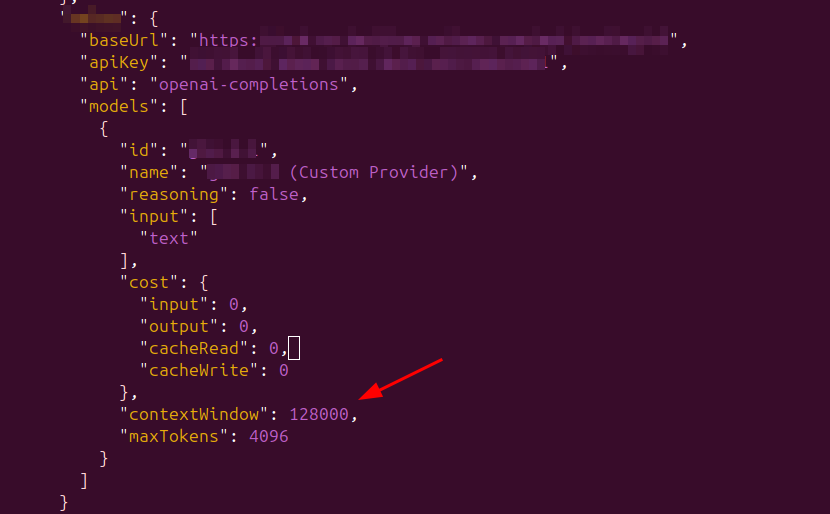
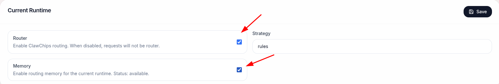

# ClawChips Quick Start

**目录**

[TOC]

---

## 1 环境准备

### 1.1 硬件要求

- RK_EVB10_RK3588_V10开发板 × 1
- 1828协处理器 × 1
- USB-C数据线 × 1
- RK3588电源适配器 × 1
- 计算机 × 1

### 1.2 连接开发板

1. 将RK1820/1828模组插入到RK_EVB10_RK3588_V10开发板上
1. RK_EVB10_RK3588_V10开发板需连接互联网
2. 将开发板上的USB端口通过数据线与计算机相连
3. 打开电源开关，等待开发板系统启动完成
4. 验证设备连接

```bash
# 计算机（主机）的终端执行

# 查询adb连接的设备
adb devices

# 连接成功时输出信息如下，其中 13af7b28115662cd 为 RK3588 的设备 ID
# List of devices attached
# 13af7b28115662cd device
```

### 1.3 验证RK1820/1828连接

```bash
# 连接RK3588
adb shell

# 进入rknn3_transfer_proxy安装路径（Linux系统）
cd /usr/bin

# 查询设备
./rknn3_transfer_proxy devices

# 参考输出如下
# List of ntb devices attached
# 0000:01:00.0        b98e6c51    PCIE
```

> **注意**：若找不到rknn3_transfer_proxy，请先完成第2章部署ClawChips

---

## 2 部署 ClawChips

### 2.1 检查固件是否已经出厂烧写
首先检查开发板是否已经烧写ClawChips系统镜像：

```bash
# 连接RK3588
adb shell

# 切换到普通用户
su linaro

# 检查命令
openclaw plugins list |grep clawchips

# 预期输出如下字段，则说明已烧写 ClawChips 系统镜像，否则未烧写
# clawchips    │          │ openclaw │ loaded   │ global:clawchips/dist/index.js
```

若已烧写ClawChips系统镜像，则可以直接跳转至 [2.3 配置云端模型](#configCloud)

本文部署所需的资源文件可网盘下载，请向官方邮箱发邮件申请获取链接：[rkmarketing@rock-chips.com](mailto:rkmarketing@rock-chips.com)

### 2.2 系统镜像快捷部署

烧写系统镜像的步骤如下：
* 从网盘的images目录下载最新的镜像文件压缩包，然后解压
* RK3588开发板上的 ADB  端口通过数据线与计算机相连
* 完成驱动安装：
  - Windows：安装 DriverAssitant_v5.14 驱动；
  - Linux ：无需安装，直接使用 upgrade_tool 工具即可；
  - Mac : 无需安装，直接使用 upgrade_tool 工具即可。
* 安装烧写工具（位于网盘的tools目录下）：
  - Windows：使用 RKDevTool_v3.41_for_window 工具
  - Linux：使用 upgrade_tool_v2.55_for_linux 工具
  - Mac: 使用 upgrade_tool_v2.55_for_mac工具
* 烧写
  * RKDevTool_v3.41_for_window：解压即用，解压后可参考文档 《开发工具使用文档_v1.0.pdf》
  * upgrade_tool_v2.55_for_linux ：解压即用，解压后可参考文档《命令行开发工具使用文档.pdf》
  * upgrade_tool_v2.55_for_mac ：解压即用，解压后可参考文档《命令行开发工具使用文档.pdf》


- 分区调整

为了压缩固件的体积，这里对固件的rootfs和userdata分区进行了压缩，可以在烧写完成后可以使用如下命令重新调整分区大小

```bash
# 连接RK3588
adb shell

# 调整分区大小
resize2fs /dev/mmcblk0p6
resize2fs /dev/mmcblk0p8

# 查看分区大小，可以看到/和/userdata的挂载点容量大小已经变大
df -h
#文件系统        大小  已用  可用 已用% 挂载点
#/dev/root        14G  5.4G  7.8G   41% /
#devtmpfs        3.8G   12K  3.8G    1% /dev
#tmpfs           3.9G     0  3.9G    0% /dev/shm
#tmpfs           1.6G  2.4M  1.6G    1% /run
#tmpfs           5.0M   20K  5.0M    1% /run/lock
#tmpfs           3.9G   88K  3.9G    1% /tmp
#/dev/mmcblk0p7  124M  5.3M  118M    5% /oem
#/dev/mmcblk0p8   44G  7.2G   35G   18% /userdata
#tmpfs           792M   40K  792M    1% /run/user/1000
```


### 2.3 配置云端模型 <span id="configCloud"></span>

这一步主要为了配置API服务。因为本地部署的模型服务在安装ClawChips插件时会自动配置，此处只需要完成云端模型厂商API服务配置

```bash
# 连接RK3588
adb shell

# 切换为普通用户
su linaro

# 初始化 OpenClaw
openclaw onboard --install-daemon
```

详细步骤：

* 选择yes后enter；选择QuickStart


* 选择Use existing values


* 配置模型

  * 选择云端模型厂商的名称。此处以⾃部署的模型为例，选择Custom Provider

  

  * 配置API base URL，需要配置为真实的URL

  

  * 配置API key

  

  * 选择OpenAI-compatible；输入Model ID，用户需要配置为真实的Model ID

  

* 后续的配置流程先跳过，选择Skip for now，例如：


* 配置完成后重启OpenClaw


- **模型上下文配置**

默认配置的模型上下文为16k，会很容易触发压缩影响体验，需要修改一下openclaw的配置文件`/home/linaro/.openclaw/openclaw.json`

将配置的model的contexWindow修改为模型支持的最大上下文大小，如下图所示



------

## 3 安装 QQBot 插件

推荐使用QQ插件，对于图片/语音等多媒体文件格式交互更方便。

### 3.1 安装 QQBot

* 访问官方网站：https://q.qq.com/qqbot/openclaw/index.html

* 点击创建机器⼈，然后获取到AppID和AppSecret

* 根据官⽅教程安装插件和配置

```bash
# 连接RK3588
adb shell 

# 切换为普通用户
su linaro

# 安装OpenClaw开源社区QQBot插件
openclaw plugins install @tencent-connect/openclaw-qqbot@latest

# 配置绑定当前QQ机器人
openclaw channels add --channel qqbot --token "your-appid:your-appsecret" 

# 重启本地OpenClaw服务
openclaw gateway restart
```

重启完成就可以⽤QQ上创建的机器⼈直接给OpenClaw发送消息

### 3.2 启用QQ消息优化（可选）

同时安装ClawChips和QQBot前提下，可以启用ClawChips对QQBot的优化：

* OpenClaw启动后即可访问Dashboard Web页面，访问的URL：`http://<ip>:18789/plugins/clawchips/dashboard`
* 在Web页面开启优化，并保存配置


此优化可以将工具调用的提示发送到QQ消息中，优化响应体验

------

### 3.3 测试验证

在QQ中和机器人的聊天窗口输入`/new`开启新对话，应收到机器人的打招呼回复消息，此时可以正常和开发板的OpenClaw正常进行交互。

------

## 4 RK SKILL使用说明

固件内置了一系列基于RK182X模组运行的ASR/TTS/VL/RAG算法，能够通过SKILL被OpenClaw进行调用，以下是当前开发的SKILL示例（这些skill位于`/home/linaro/.openclaw/workspace/skills`目录）。

### 4.1 RK-VL

#### 4.1.1 功能简介

基于视觉大语言模型（当前基于Qwen3-VL-2B）做自然语言描述任意的目标检测与摄像头持续监控。

#### 4.1.2 调用示例

**示例一：对摄像头画面进行监控（需要接一个USB摄像头）**

- 用户输入

```
帮我监控摄像头，当有快递出现的时候提醒我
```

- 输出说明

  - 当开启监控成功后会有如下消息返回：

    ```
    已开启摄像头监控，目标为「快递」。检测到时会立即提醒你。
    ```

  - 当有检测到目标时候会有如下消息返回：

    ```
    检测到目标“一只招财猫”，图像如下：
    <对应图片>
    ```

### 4.2 RK-TTS

#### 4.2.1 功能简介

支持直接在板端调用文本转语音（TTS： Text To Speech）能力，可以支持板子播放或者返回输出音频文件

#### 4.2.2 调用示例

**示例一：返回输出音频文件**

- 用户输入

```
帮我把下面这段话转成音频：
"夜幕笼罩着古老的城堡，月光透过彩色玻璃在地面投下斑驳光影。主人公手握烛台，沿着螺旋石阶缓缓下行，靴底与青苔覆盖的台阶摩擦发出细微声响"
```

- 输出说明

预期QQ中应该能够收到对应文字转录的音频文件

**示例二：直接开发板播放**

- 用户输入

```
直接朗读这段话：
"Surely we ought to hold fast to life, for it is wondrous, and full of a beauty that breaks through every pore of God’s own earth."
```

- 输出说明

预期开发板应该能够播放出对应文字的音频


### 4.3 RK-ASR

#### 4.3.1 功能简介

实现音频文件语音转录，传入音频文件，即可输出对应的文字识别结果。

#### 4.3.2 调用示例

推荐通过 QQ 机器人快速交互使用。

**示例一：指定板端音频路径**

- 用户输入

```
帮我转录音频文件：/userdata/40s_rkdc.wav
```

- 输出说明

  - 短音频（30 秒内）：直接返回纯文字转录结果

  - 长音频（超过 30 秒）：生成 TXT 文档并发送，保存完整转录内容

**示例二：直接上传音频**

- 用户输入

直接在 QQ 聊天框直接发送音频文件

- 输出说明

同上

### 4.4 RK-MEETING-WATCHER

#### 4.4.1 功能简介

支持自定义关键词，实时监听会议语音内容。依托 ASR 服务对麦克风音频流进行实时文字转写，持续匹配预设关键词。一旦检测到目标关键词，将通过 QQ 推送提醒消息，及时跟进会议关键信息。

推荐通过 QQ 机器人快速交互使用。为保证监听与识别精度，建议搭配外接 USB 麦克风使用。

板载麦克风及主流 USB 麦克风均依赖 `alsa-utils` 组件，需提前在设备中安装：

```bash
sudo apt update
sudo apt install alsa-utils
```

#### 4.4.2 调用示例

**示例一：会议关键词监听**

- 用户输入

  - 开启监听：`请帮我开启会议监听，关键词“龙虾”`

  - 关闭监听：`停止会议监听`


- 输出说明

系统识别到预设关键词后，将主动推送 QQ 提醒：

````
您设置的关键词已触发，请关注会议！
````

### 4.5 RK-RAG

#### 4.5.1 功能简介

实现知识库检索问答，传入 Markdown 文档构建知识库，或基于已有知识库检索并回答问题。

#### 4.5.2 调用示例

推荐通过 QQ 机器人快速交互使用。

**示例一：构建知识库**
- 用户输入

```
帮我将 /home/linaro/.openclaw/workspace/skills/rk-rag/example/1820.md 加入 rk 知识库
```

- 输出示例

```
目标知识库：rk.db / 新增 chunk：12 条 / chunk 总数：12 条
```

**示例二：查询知识库**

- 用户输入

```
根据 rk 知识库，告诉我 rk1820 支持和哪些设备协作
```

- 输出示例

```
RK1820 支持与 RK3588 和 RK3576 这类主控 SoC 设备协作。它作为协处理器，通过 PCIe 或 USB 接口连接到这些主控芯片上，专注于 AI 模型的加速计算任务。这种协作方式让系统能够更高效地运行 AI 应用，尤其是在部署像 FastVLM、Qwen2.5-VL-3B 这样的多模态模型时表现良好。
```

**示例三：列举知识库**

- 用户输入

```
查看当前有哪些知识库
```

- 输出示例

```
当前知识库列表：
  - rk.db  (documents: 2, chunks: 24)
      source: /home/linaro/.openclaw/workspace/skills/rk-rag/example/1820.md
      source: /home/linaro/.openclaw/workspace/skills/rk-rag/example/guide.md
  - report.db  (documents: 1, chunks: 8)
      source: /home/linaro/.openclaw/workspace/skills/rk-rag/example/report.md
```

#### 4.5.3 本地问答模型配置
rk-rag 默认使用云端 LLM 生成回答，对于有隐私要求的客户，可切换为本地模型。从网盘下载 `qwen3-4b-instruct-2507` 模型，安装到板子：

```bash
adb push /path/to/qwen3-4b-instruct-2507 /userdata/model_hub
adb push /path/to/qwen3-4b-instruct-2507/rkllm-qwen3-4b-instruct-2507-server.service /etc/systemd/system/
```

若模型文件和配置均已就绪，search 模式会自动检测并使用本地 LLM，无需其他操作。

#### 4.5.4 注意事项
- 构建知识库时，若未指定知识库名称，知识库将以文档名称命名
- 若将文档加入已存在的知识库，文档将以追加的方式进入知识库
- 知识库来源文档仅支持 Markdown（.md）格式
- 需要使用文档的完整路径

------

## 5 本地大模型和路由体验（可选）

**说明**：

- 使用本地大模型作为OpenClaw的Provider当前还处于实验阶段，仅供体验。
- 模组必须选用RK1828，RK1820模组的内存不够，无法运行。
- 启动本地大模型之后RK1828内存基本占满，此时无法再体验SKILL中ASR/TTS/VLM/RAG等算法功能

### 5.1 部署本地大模型 API 服务

#### 5.1.1 部署模型文件

从网盘models目录下载模型 qwen3-4b-thinking，目录结构如下：

```bash
qwen3-4b-thinking
├─ Qwen3-4B.rknn           #RKNN 模型文件
├─ Qwen3-4B.tokenizer.gguf #词表文件
├─ Qwen3-4B.embed.bin      #embedding 文件
├─ Qwen3-4B.weight         #weight 文件
└─ run.sh                  #启动rkllm3-server的脚本
```

将模型文件推送至板端：

```bash
# 推送文件
adb push qwen3-4b-thinking /userdata/
# 同步文件系统
adb shell sync
```

#### 5.1.2 启动 rkllm3-server

```bash
# 连接RK3588
adb shell 

# 切换到模型文件目录
cd /userdata/qwen3-4b-thinking

# 增加可执行权限
chmod +x ./run.sh

# 启动 rkllm3-server
./run.sh
```

#### 5.1.3 验证 rkllm3-server

启动后，通过以下命令验证服务是否正常运行：

```bash
# 在主机端执行，测试 API 是否可访问
curl http://127.0.0.1:8080/v1/models

# 预期输出示例：
# {
#   "object": "list",
#   "data": [
#     {
#       "id": "Qwen3-4B",
#       "object": "model",
#       "created": 1234567890,
#       "owned_by": "rockchip"
#     }
#   ]
# }

# 或者在开发板终端检查进程
adb shell "ps aux | grep rkllm3-server"
```

### 5.2 配置 ClawChips路由

#### 5.2.1 使能本地路由

* OpenClaw启动后在主机端访问Dashboard Web页面，访问的URL：`http://<ip>:18789/plugins/clawchips/dashboard`
* 使能本地路由和记忆路由





* 在Web页面开启的下拉选项中选择CLOUD model ID配置，预期为之前配置的OpenClaw云端模型，然后点击保存


####  5.2.2 本地路由使用

可参考文档使用：

https://github.com/airockchip/clawchips/blob/main/README_ZH.md#%E4%BD%BF%E7%94%A8%E6%8C%87%E5%8D%97

------
## 附录

### 附录 A：目录结构

```
~/.openclaw/
├── openclaw.json          # 主配置文件
├── clawchips.yaml         # ClawChips 配置文件
├── workspace              # 工作目录
└── agents/
    └── main/
        └── sessions/      # 对话会话目录
```

### 附录 B：参考资源

- OpenClaw 官方文档：https://docs.openclaw.ai/install
- ClawChips GitHub：https://github.com/airockchip/clawchips
- RKNN3 Toolkit GitHub：https://github.com/airockchip/rknn3-toolkit

### 附录 C：常见问题

#### 1 adb 连接问题

**问题：执行 `adb devices` 显示找不到设备**

解决方法：
```bash
# 检查 adb 服务是否启动
adb start-server

# 如果设备仍无法识别，检查 USB 调试是否开启
# 在开发板上执行：设置 -> 开发者选项 -> USB 调试（开启）
```

**问题：如何通过网络连接 adb（无需 USB 线）**

```bash
# 1. 先通过 USB 连接开发板
# 2. 在开发板上设置 TCPIP 模式
adb shell
setprop service.adb.tcp.port 5555
stop adbd
start adbd

# 3. 在主机端执行
adb connect <开发板IP>:5555

# 4. 断开 USB 线，后续可通过 WiFi 连接
```

#### 2 rknn3_transfer_proxy 问题

**问题：执行 `./rknn3_transfer_proxy devices` 找不到设备**

可能原因：
1. RK1820 固件未正确烧录 - 请重新执行 2.3 节安装命令
2. PCIe/USB 连接异常 - 检查硬件连接
3. 设备未重启 - 执行 `adb shell reboot` 重启开发板

#### 3 OpenClaw 安装问题

**问题：npm install 失败，提示网络错误**

解决方法：
```bash
# 配置 npm 代理（如果需要）
npm config set proxy http://<代理地址>:<端口>
npm config set https-proxy http://<代理地址>:<端口>

# 或者使用国内镜像
npm config set registry https://registry.npmmirror.com
```

**问题：安装 OpenClaw 报错 `ENOTEMPTY`**

解决方法：
```bash
# 删除旧的 OpenClaw 目录后重试
rm -rf ~/.npm-global/lib/node_modules/openclaw
npm install -g openclaw@2026.3.24
```

**问题：局域网无法访问Dashboard web页面**

解决方法：
openclaw的gateway配置可以参考如下进行修改，但是安全性会降低需要注意：

```
  "gateway": {
    "port": 18789,
    "mode": "local",
    "bind": "lan",
    "controlUi": {
      "allowedOrigins": [
        "http://localhost:18789",
        "http://127.0.0.1:18789",
        "http://192.168.31.82:18789"
      ],
      "dangerouslyAllowHostHeaderOriginFallback": true,
      "allowInsecureAuth": true,
      "dangerouslyDisableDeviceAuth": true
    },
  }
```

#### 4 rkllm3-server 问题

**问题：rkllm3-server 启动失败，提示找不到模型文件**

确保模型文件路径正确：
```bash
# 检查模型文件是否存在
adb shell
ls -la /path/to/your/model/*.rknn
ls -la /path/to/your/model/*.tokenizer.gguf
ls -la /path/to/your/model/*.embed.bin
```

**问题：API 请求返回连接失败**

```bash
# 检查 rkllm3-server 是否正在运行
adb shell
ps aux | grep rkllm3-server

# 检查端口是否正常监听
netstat -tlnp | grep 8080
```

