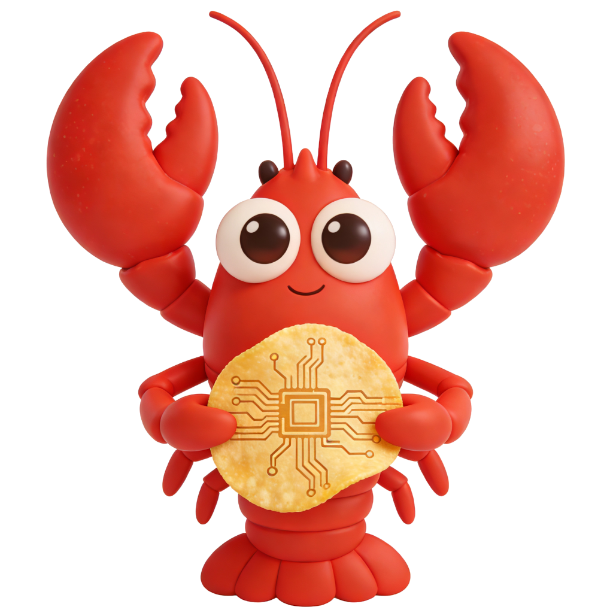
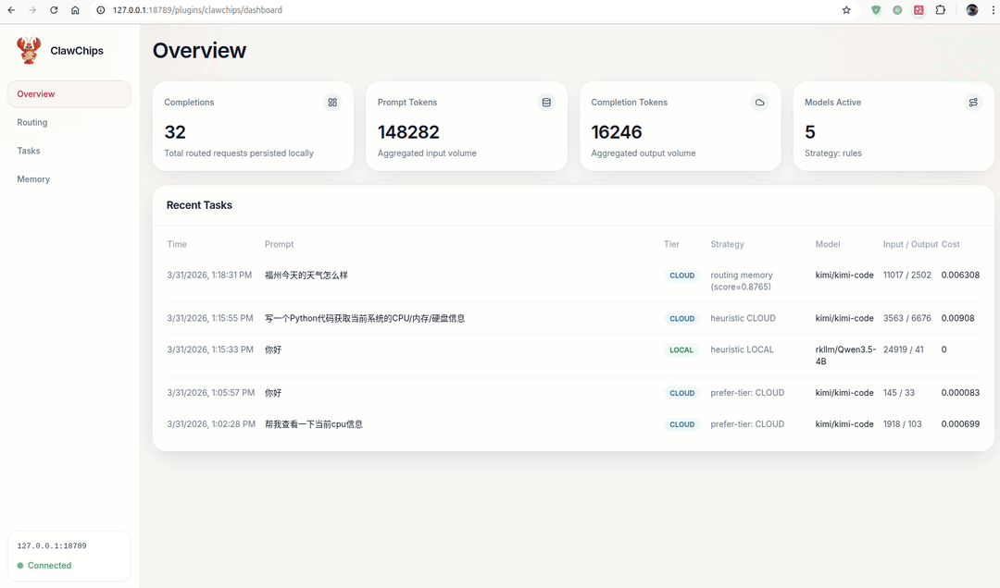
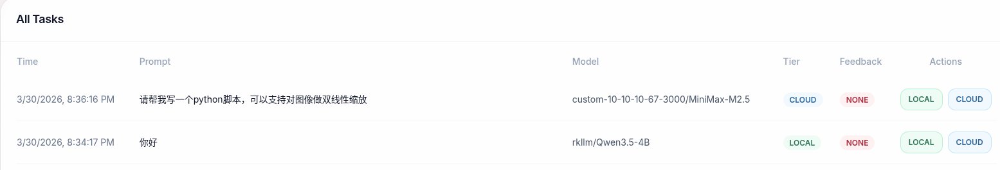
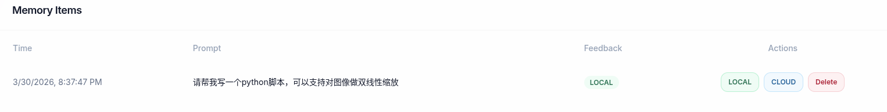

<div align="center">
  

  <h1 align="center"><strong style="color:rgb(202, 31, 31);">ClawChips</strong></h1>

**ClawChips**: An open source solution for optimizing OpenClaw deployments on edge devices

**English | [中文](./README_ZH.md)**

</div>

---

**Note**: The current release is v0.5.0 technical preview; a stable release is coming soon.

## About ClawChips

The ClawChips open source project is a reference solution for edge deployment and optimizing OpenClaw. It provides an intelligent edge-cloud routing gateway, a curated set of practical edge-side skills, a visual dashboard, and more to improve the experience of using OpenClaw on edge platforms.

| Feature | Description |
| --- | --- |
| **Local / Cloud Intelligent Routing** | Intelligently detects task complexity and automatically dispatches requests between local and cloud models to reduce token usage. |
| **Feedback-Driven Memory** | Writes request history and feedback labels into memory to improve later routing decisions for similar requests. |
| **SKILLS** | Includes a curated collection of practical edge-side skills, with more to come over time. |
| **Dashboard** | Provides routing statistics, runtime configuration, provider management, feedback labeling, and memory inspection. |

---

## Edge-Cloud Routing

ClawChips includes a local routing gateway that sits between OpenClaw and multiple model backends.

- Intelligently detects task complexity and routes task requests between local and cloud via the local intelligent router
- Supports memory-assisted routing for continuously improved routing decisions
- Includes a dashboard configuration interface

```text
┌─────────────────┐     ┌──────────────────────┐               ┌─────────────────────────┐
│    Channels     │────▶│       OpenClaw       │──────────────▶│          CLOUD          │
│                 │     │     Gateway/App      │────────┐      │ ┌─────────────────────┐ │
└─────────────────┘     └──────────────────────┘        │      │ │        Qwen         │ │
                               │      ▲                 │      │ └─────────────────────┘ │
                               │      │                 │      │ ┌─────────────────────┐ │
                               │      │                 │      │ │        Kimi         │ │
                               ▼      │                 │      │ └─────────────────────┘ │
                        ┌─────────────────────┐         │      │ ┌─────────────────────┐ │
                        │      ClawChips      │         │      │ │         GLM         │ │
                        │     LocalRouter     │         │      │ └─────────────────────┘ │
                        └─────────────────────┘         │      │ ┌─────────────────────┐ │
                                                        │      │ │    OpenAI / More    │ │
                                                        │      │ └─────────────────────┘ │
                                                        │      └─────────────────────────┘
                                                        │
                                                        │      ┌─────────────────────────┐
                                                        └─────▶│          LOCAL          │
                                                               │      RKLLM Server       │
                                                               └─────────────────────────┘
```

---

## Dashboard Features

The gateway includes a dashboard for convenient configuration. A demo is shown below:



---

## SKILLS

The [skills](./skills) directory includes curated practical skills for edge chip platforms; more will be adapted and expanded over time. Developer contributions are welcome.

## Installation Guide

### Requirements

- RK3588+RK1828 Debian/Ubuntu operating system

### ClawChips Installation Steps

#### 1. Install OpenClaw

Please follow the [OpenClaw official documentation](https://docs.openclaw.ai/install) to install and configure OpenClaw. If it is already installed, you can skip this step.

```
npm install -g openclaw@2026.3.24
openclaw onboard --install-daemon
```

Note: ClawChips is currently tested with OpenClaw `2026.3.24 (cff6dc9)`.

#### 2. Install ClawChips

- Obtain the package

**Option 1:** Download a release package directly

Visit the [releases page](https://github.com/airockchip/clawchips/releases) to download.

**Option 2:** Build the plugin package yourself

For the first build, install the required dependencies:

```bash
git clone https://github.com/airockchip/clawchips
cd clawchips-plugin/
npm install
```

For each subsequent build, from the project root, run:

```
bash scripts/package_dist.sh
```

Copy `dist/clawchips.zip` to your development board for installation.

- Install

Run the following command to install:

```
openclaw plugins install clawchips.zip
```

- Initial configuration

Follow the prompts and run the following command to initialize the configuration:

```
node ~/.openclaw/extensions/clawchips/scripts/setup.mjs
```

#### 3. Install memory routing dependencies (Optional)

If you enable memory-based routing, you also need to deploy an embedding model service locally on the RK3588 as follows. If you are using the provided firmware image, this service may already be included, and you only need to confirm that it is running properly.

```
cd /userdata/
curl -fsSL https://raw.githubusercontent.com/airockchip/clawchips/main/scripts/install_memory_router_deps.sh | bash -s --
```

Confirm that the service is running properly:

```
journalctl -u embedding-rknn-server.service
# If you see logs like the following, the service started successfully
I:        Application startup complete.
I:        Uvicorn running on http://0.0.0.0:18080 (Press CTRL+C to quit)
```

#### 4. Restart OpenClaw

```
openclaw gateway restart
```

After startup, you can access the Dashboard web UI at `http://<ip>:18789/plugins/clawchips/dashboard`.

## User Guide

### Try the routing feature

After chatting with OpenClaw, open the `Tasks` page in the dashboard:



You can also label results here; labeled items can be viewed on the `Memory` page in the dashboard:



### Chat directives

If you are not satisfied with the routing result, you can add directives starting with `@` in the chat to choose a model or routing tier directly. The following directives are supported:

- `@model(model-id)`

Example:

```
@model(Qwen3.6-Plus) Please write a SKILL that can send and receive email
```

- `@local` / `@cloud`

Example:

```
@local Hello
```

```
@cloud Please write a SKILL that can send and receive email
```

After a directive is set, it is remembered and affects the next selection; you can review this on the `Memory` page in the dashboard.

---

## FAQ

- Cannot access the Dashboard web page from the LAN

You can adjust the OpenClaw gateway configuration as shown below. Note that this reduces security:

```
  "gateway": {
    "port": 18789,
    "mode": "local",
    "bind": "lan",
    "controlUi": {
      "allowedOrigins": [
        "http://localhost:18789",
        "http://127.0.0.1:18789",
        "http://192.168.31.82:18789"
      ],
      "dangerouslyAllowHostHeaderOriginFallback": true,
      "allowInsecureAuth": true,
      "dangerouslyDisableDeviceAuth": true
    },
  }
```

## Join us — developers, explore countless possibilities together

To fully support efficient development and innovation, we offer a dedicated co-creation support program. Scan the QR code below to apply for complimentary loan of an RK3588 + RK1828 development kit. Based on your submission quality and fit, we will offer enterprises and developers a one-month hands-on kit experience so you can more easily explore the full capabilities of ClawChips and refine high-quality skills.


## Reference Projects

- [OpenClaw](https://github.com/openclaw/openclaw)
- [EdgeClaw](https://github.com/OpenBMB/EdgeClaw)
- [UncommonRoute](https://github.com/CommonstackAI/UncommonRoute)
- [ClawRouter](https://github.com/BlockRunAI/ClawRouter)
- [LLMRouter](https://github.com/ulab-uiuc/LLMRouter)

---

## License

MIT
