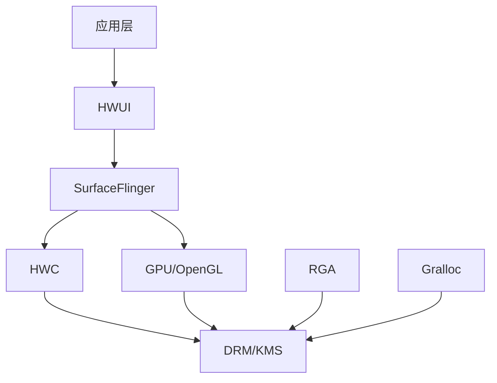

# 图形系统模块概览

## 模块架构



## 模块职责

### SurfaceFlinger
Android 显示合成器，负责将多个应用的界面合成为最终显示画面。
- **常见问题**: 镜像输出、梯形矫正、开机动画显示不全

### HWC (Hardware Composer)
硬件合成器，决定使用 GPU 还是硬件 overlay 进行显示合成。
- **常见问题**: HDMI 热插拔异常、双屏显示问题、分辨率切换失败

### GPU
图形处理单元，负责 3D 渲染和部分 2D 合成。
- **Mali GPU**: RK3399/RK3326/RK3288 等
- **PVR GPU**: RK3368
- **常见问题**: Fence Timeout、驱动初始化失败、性能不足

### RGA
2D 图形加速器，用于图像缩放、旋转、格式转换等。
- **常见问题**: 颜色偏差、对齐约束、内存越界

### HWUI
Android 硬件 UI 渲染引擎。
- **常见问题**: APK 崩溃、关闭硬件加速

### Gralloc
图形内存分配器。
- **常见问题**: 内存泄露、异常横条纹

## 问题分类

| 类型 | 典型现象 | 相关模块 |
|------|----------|----------|
| 显示异常 | 花屏、黑屏、闪屏、不满屏 | HWC, GPU, RGA |
| 性能问题 | 卡顿、FPS 低 | HWC, GPU |
| 稳定性 | 崩溃、死机、ANR | GPU, HWUI, HWC |
| 功能缺失 | Vulkan/OpenCL 不可用 | GPU |

## 调试命令速查

### 通用
```bash
# 抓取完整日志
adb logcat -c && adb logcat > log.txt

# 查看 SurfaceFlinger 状态
adb shell dumpsys SurfaceFlinger

# 查看 VOP 配置
adb shell cat /d/dri/0/summary
```

### HWC 专用
```bash
# 开启 HWC 日志 (Android 9+)
adb shell setprop vendor.hwc.log 511

# 关闭 HWC (使用 GPU 合成)
adb shell setprop vendor.hwc.enable 0
adb shell setprop vendor.hwc.compose_policy 0

# 查看 HWC 版本
adb shell getprop vendor.ghwc.version
```

### GPU 专用
```bash
# 查看 GPU 负载
cat /sys/devices/platform/*.gpu/utilisation

# 查看 Mali DDK 版本
adb shell getprop | grep mali

# 查看 PVR 版本
adb shell getprop | grep pvr

# 定频 GPU
echo 400000000 > /sys/class/devfreq/*.gpu/min_freq
echo 400000000 > /sys/class/devfreq/*.gpu/max_freq
```

### RGA 专用
```bash
# RGA 性能测试
dr-g -rga perf

# 查看 RGA 版本
cat /sys/kernel/debug/rga/rga
```
